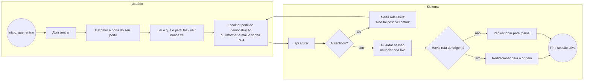
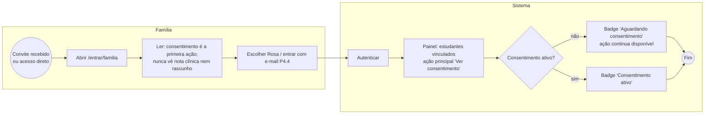
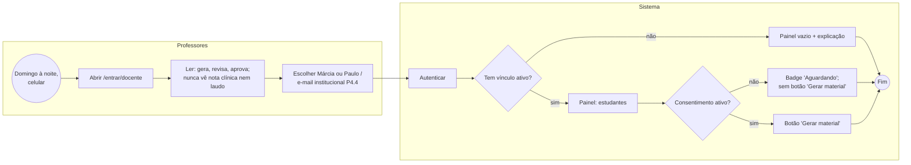
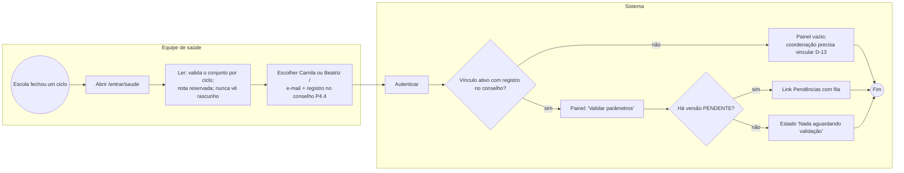
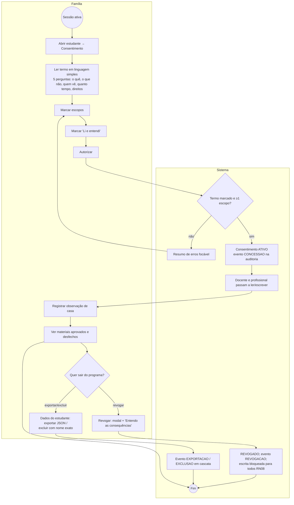
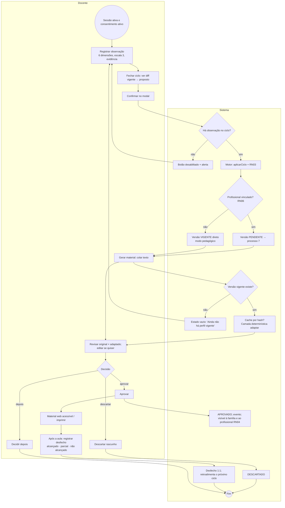
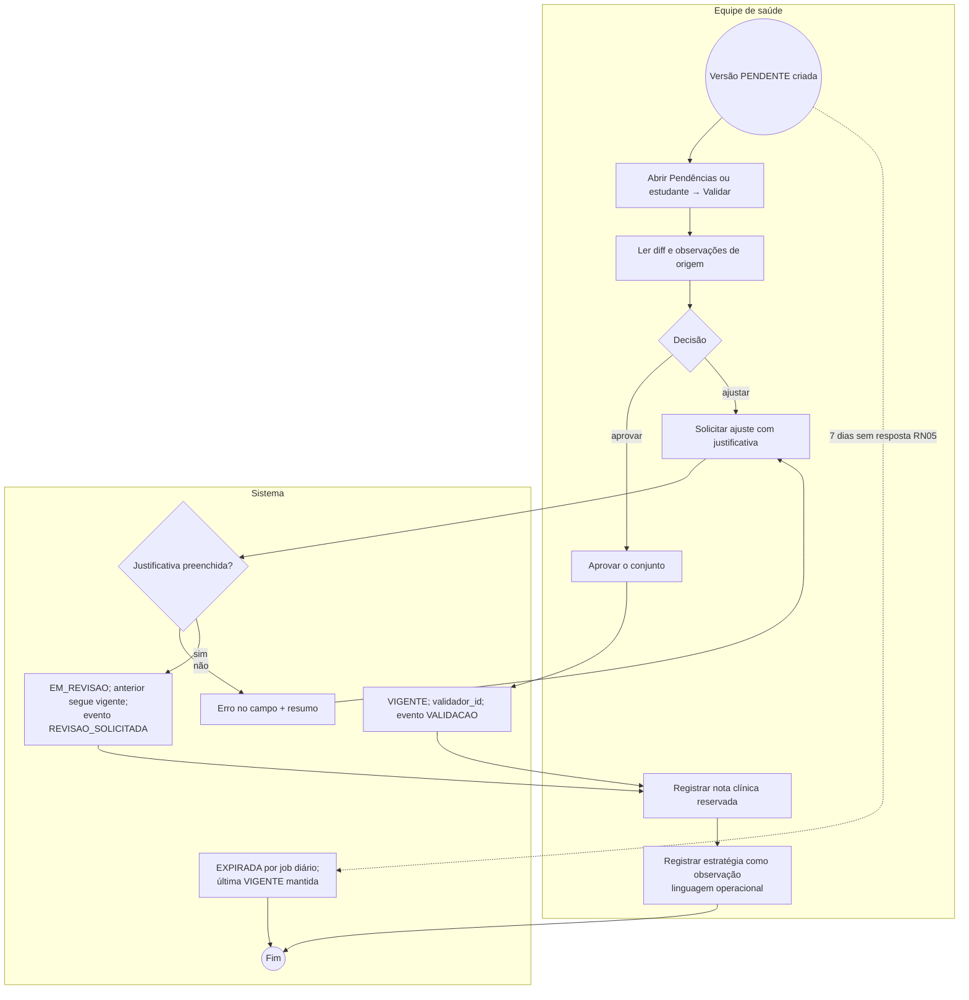
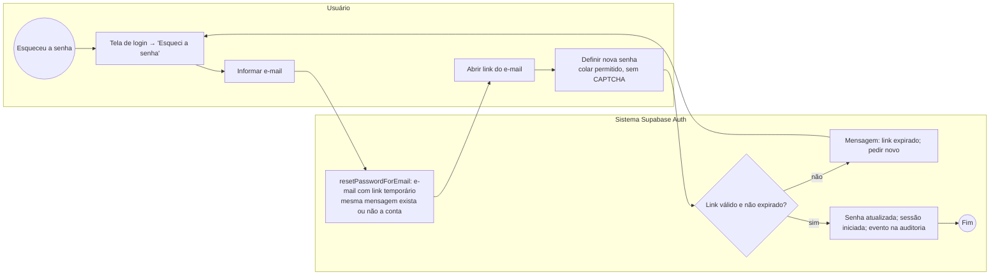
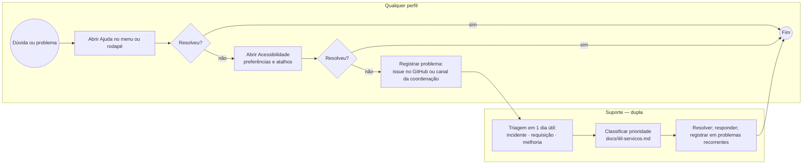
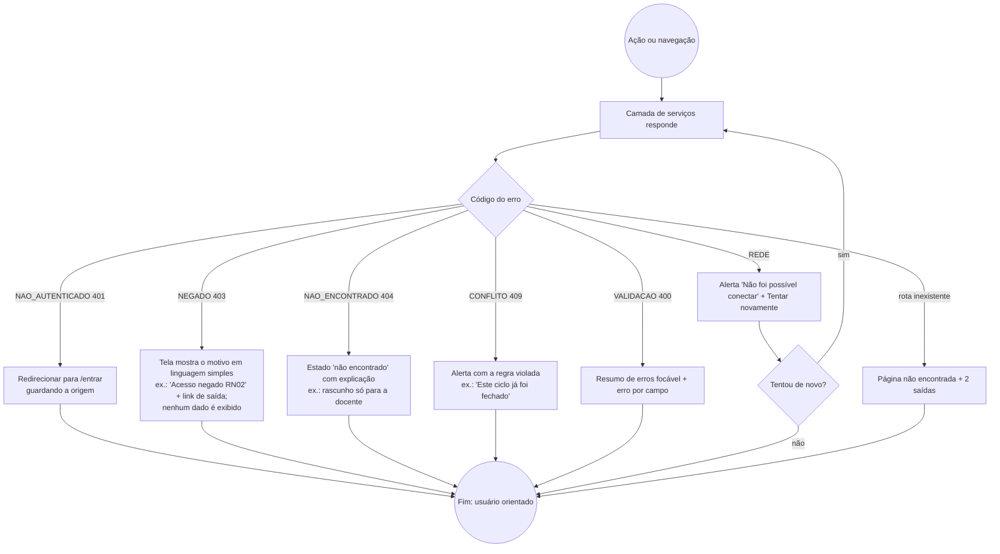

# Processos do sistema — modelagem BPMN 2.0

**Versão:** 1.0 — 21/09/2026 · **Pilar:** Qualidade e Processos.
**Notação:** os diagramas abaixo estão em **Mermaid** (renderizado pelo GitHub e pelo VS Code) usando a convenção BPMN: círculo = evento (início/fim), losango = gateway exclusivo, retângulo = atividade, `subgraph` = raia (pool/lane) por responsável. **A versão final para a monografia deve ser reproduzida em ferramenta BPMN 2.0** (Bizagi Modeler, Camunda Modeler ou draw.io com a biblioteca BPMN), exportada para `docs/tcc/bpmn/*.png` — este arquivo é a especificação textual de cada processo e permanece como fonte.
**Base:** rotas de `apps/web/src/routes/index.tsx`, regras de `services/mockApi.ts`, decisões `D-nn` e regras `RN01–RN08`. Estado real: **modo demonstração** (D-16) — os passos marcados *(P4.4)* descrevem o login real planejado.

Convenção das raias: **U** = usuário (por perfil), **S** = sistema (interface + serviços), **B** = banco/RLS (hoje simulado por `mockApi`).

---

## 1. Processo de autenticação (genérico)

| Elemento | Descrição |
|---|---|
| Evento inicial | Usuário sem sessão acessa `/entrar` (ou uma rota protegida, que o redireciona guardando `state.de`) |
| Atividades | Escolher porta (`Entrar.tsx`); ler especificação do papel (`EntrarPapel.tsx`); acionar `api.entrar(usuarioId)` |
| Decisões | G1 autenticou? (falha de rede / perfil inexistente → erro); G2 havia rota de origem? |
| Responsáveis | Usuário; sistema (`useSessao`, `RotaProtegida`) |
| Eventos intermediários | Anúncio `aria-live` "Você entrou como …" |
| Evento final | Sessão ativa; usuário no painel ou na rota de origem |
| Exceções | Falha de rede → alerta e permanece no login (TF-45); slug inválido → 404 (TF-01b); *(P4.4)* senha incorreta → "E-mail ou senha incorretos" sem dizer qual; 5 falhas → aguardar (rate limit do Supabase Auth) |
| Regras de negócio | D-16 (sem senha na demo); WCAG 3.3.8 (sem CAPTCHA, colar permitido); RN-sessão: nunca guardar senha no cliente |
| Entrada / saída | Entrada: identificador do perfil (ou e-mail + senha). Saída: `Usuario` em contexto; `localStorage["pei-vivo:sessao"]` (demo) / JWT (real) |

## 2. Login do familiar (responsável legal)

| Elemento | Descrição |
|---|---|
| Evento inicial | Responsável recebe convite da coordenação (P3.x `convidar-responsavel`) ou abre a porta Família |
| Atividades | Ler especificação; autenticar; ver painel com ação "Ver consentimento" |
| Decisões | Consentimento ativo? (muda badge, não bloqueia — D-11: responsável sempre lê) |
| Responsáveis | Responsável; sistema |
| Evento final | Painel da família |
| Exceções | Sem vínculo → estado vazio "Nenhum estudante vinculado a você" + orientação de pedir à coordenação |
| Regras | RN01/RN08 (só ele concede/revoga); D-11 (lê sempre); RF15 (exporta/exclui) |
| Entrada / saída | Entrada: identidade. Saída: lista de estudantes com papel RESPONSAVEL |

## 3. Login do professor (docente regente)

| Elemento | Descrição |
|---|---|
| Evento inicial | Docente abre a porta Professores |
| Atividades | Autenticar; painel com "Gerar material" quando há consentimento |
| Decisões | Vínculo ativo? (Paulo demonstra o vazio); consentimento ativo? (heurística 1, sev. 3 corrigida: ação oculta sem consentimento) |
| Responsáveis | Docente; sistema |
| Evento final | Painel do docente |
| Exceções | URL de estudante sem vínculo → "Acesso não permitido"; `/notas-clinicas` → "Acesso negado (RN02)" |
| Regras | RN01, RN02, D-01 (laudo oculto), D-02 (só docente gera), D-12 (rascunho privado) |
| Entrada / saída | Identidade → lista de estudantes com papel DOCENTE |

## 4. Login do terapeuta (equipe de saúde)

| Elemento | Descrição |
|---|---|
| Evento inicial | Profissional abre a porta Equipe de saúde (uso ocasional) |
| Atividades | Autenticar; painel com "Validar parâmetros"; fila de pendências |
| Decisões | Vínculo com registro no conselho (D-13)? Há versão pendente? |
| Responsáveis | Profissional; sistema; coordenação (vincula) |
| Evento final | Painel do profissional |
| Exceções | Sem registro no conselho o vínculo nem é criado (VALIDACAO); versão expirada (RN05) aparece como "Expirada" |
| Regras | RN02 (nota reservada), RN05, RN07 (valida ciclo, não material), D-13, D-14 |
| Entrada / saída | Identidade → estudantes com papel PROFISSIONAL_SAUDE + pendências |

## 5. Processo principal do familiar — consentir e acompanhar

| Elemento | Descrição |
|---|---|
| Evento inicial | Sessão da família ativa |
| Atividades | Ler termo; escolher escopos (`observacao_pedagogica`, `observacao_domiciliar`, `geracao_material`); autorizar; observar em casa; acompanhar; revogar; exportar; excluir |
| Decisões | Termo lido + ≥ 1 escopo? Revogar? Excluir? |
| Responsáveis | Responsável (decide); sistema (audita); docente/profissional (consumidores do consentimento) |
| Eventos intermediários | Eventos de auditoria CONCESSAO, REVOGACAO, EXPORTACAO, EXCLUSAO; toast + `aria-live` |
| Evento final | Consentimento ativo (fluxo segue nos processos 6 e 7) ou revogado/excluído |
| Exceções | Já existe consentimento ativo → CONFLITO; nome errado na exclusão → VALIDACAO; outro papel tentando → NEGADO |
| Regras | RN01, RN08, RF02, RF15, D-05, D-06, D-11 |
| Entrada / saída | Escopos marcados → `Consentimento{status, escopo, dataConcessao}`; auditoria |

## 6. Processo principal do professor — observar, fechar ciclo, gerar, aprovar, desfecho ⭐

| Elemento | Descrição |
|---|---|
| Evento inicial | Sessão do docente + consentimento ativo (sem ele, tudo bloqueado — RN01) |
| Atividades | Observar (`/observar`); fechar ciclo (`/fechar-ciclo`); gerar (`/gerar`); revisar (`/materiais/:id/revisar`); material (`/materiais/:id`); desfecho (`/desfecho`) |
| Decisões | Há observação? Profissional vinculado (RN06)? Versão vigente? Aprovar/descartar/depois? |
| Responsáveis | Docente; sistema (motor); profissional (processo 7) |
| Eventos intermediários | Versão PENDENTE enviada à validação; toast "Gerado em 0,3 s"; eventos CICLO_FECHADO, APROVACAO_MATERIAL, DESCARTE_MATERIAL |
| Evento final | Desfecho registrado (retroalimentação) ou rascunho descartado |
| Exceções | Ciclo já fechado → CONFLITO; texto vazio ou > 20 000 → VALIDACAO; sem vigente → CONFLITO; segundo desfecho → CONFLITO; revogação no meio → NEGADO imediato |
| Regras | RN01, RN03 (2 ciclos para elevar), RN04 (só APROVADO chega ao estudante), RN06, RF05–RF13, D-02, D-12, D-18 |
| Entrada / saída | Observações + texto original → `VersaoPerfil`, `Material{textoAdaptado, statusAprovacao}`, `Desfecho` |

## 7. Processo principal do terapeuta — validar o ciclo e registrar nota

| Elemento | Descrição |
|---|---|
| Evento inicial | Versão PENDENTE criada pelo fechamento de ciclo (processo 6) |
| Atividades | Ler diff; aprovar ou pedir ajuste; nota clínica (`/notas-clinicas`); observação clínica |
| Decisões | Aprovar/ajustar? Justificativa preenchida? |
| Responsáveis | Profissional; sistema (job diário RN05 — hoje simulado na leitura) |
| Eventos intermediários | Temporizador de 7 dias (evento intermediário de tempo, BPMN *timer*) |
| Evento final | Versão VIGENTE / EM_REVISAO / EXPIRADA; nota registrada |
| Exceções | Docente tentando validar → NEGADO; validar versão já vigente → CONFLITO; nota vazia → VALIDACAO; docente/família/coordenação lendo nota → NEGADO (RN02) |
| Regras | RN02, RN05, RN07, D-07, D-09 |
| Entrada / saída | `VersaoPerfil{PENDENTE}` → `{VIGENTE|EM_REVISAO|EXPIRADA}`; `NotaClinica` |

## 8. Processo de recuperação de acesso

**Estado:** não existe no modo demonstração (não há senha). **Planejado** para P4.4 com Supabase Auth.

| Elemento | Descrição |
|---|---|
| Evento inicial | Usuário não consegue entrar |
| Atividades | Solicitar redefinição; abrir link; definir nova senha |
| Decisões | Link válido? |
| Responsáveis | Usuário; Supabase Auth; sem intervenção da dupla |
| Exceções | Link expirado (1 h); e-mail não cadastrado (mesma resposta neutra, para não revelar contas) |
| Regras | WCAG 3.3.8 (sem teste cognitivo, colar permitido); LGPD (não revelar existência de conta); RN-sessão |
| Entrada / saída | E-mail → nova credencial; evento de auditoria (`SENHA_REDEFINIDA`, a acrescentar na `0004`) |

Enquanto o login real não existe, o **procedimento de suporte** vale: ver processo 9 e `docs/itil-servicos.md` §3 (requisição "Recuperação de acesso").

## 9. Processo de suporte / solicitação de ajuda

| Elemento | Descrição |
|---|---|
| Evento inicial | Usuário com dúvida ou erro |
| Atividades | Consultar Ajuda (`/ajuda`), Acessibilidade (`/acessibilidade`), guia (`docs/guia-de-uso-do-sistema.md`); registrar; triagem; resolução |
| Decisões | Autoatendimento resolveu? Tipo (incidente/requisição/melhoria)? |
| Responsáveis | Usuário; dupla (suporte de nível 1 e 2); coordenação da escola (nível 0 no piloto) |
| Evento final | Problema resolvido e registrado |
| Exceções | Problema de acessibilidade bloqueante → prioridade alta (ver ITIL §2) |
| Regras | Prazos de `docs/itil-servicos.md`; nenhum dado real de estudante em issue pública |
| Entrada / saída | Relato → issue rotulada (`incidente`, `requisicao`, `melhoria`, `acessibilidade`) → correção + entrada na base de conhecimento |

## 10. Processo de tratamento de erro e acesso negado

| Elemento | Descrição |
|---|---|
| Evento inicial | Qualquer chamada à API ou navegação |
| Atividades | Mapear `ErroApi.codigo` → mensagem (`mensagemAmigavel`) → componente (`Alerta`, `ErroCarregamento`, `ResumoErros`, `NaoEncontrada`) |
| Decisões | Código do erro; tentar novamente? |
| Responsáveis | Sistema; usuário (recuperação) |
| Eventos intermediários | `role="alert"` para erros bloqueantes; `aria-live` para os demais |
| Evento final | Usuário sabe o que houve e tem uma saída |
| Exceções | Erro desconhecido → "Algo deu errado. Tente novamente em instantes." (nunca stack trace) |
| Regras | RNF-H; heurística 9; WCAG 3.3.1/3.3.3/4.1.3; **acesso negado nunca vaza dado** (a tela recebe o erro antes de qualquer conteúdo) |
| Entrada / saída | `ErroApi{codigo, status, message}` → interface de recuperação |

---

## 11. Rastreabilidade dos processos

| Processo | Telas | Testes que o exercitam |
|---|---|---|
| 1–4 (autenticação por perfil) | Entrar, Login por perfil, Painel | `autenticacao.test.tsx` (7), `paginas.test.tsx › Entrar (D-16) e painel` (4) |
| 5 (familiar) | Consentimento, Observar, Dados | `paginas.test.tsx › Consentimento`; `mockApi.test.ts › RN01/RN08`, `› RF15` |
| 6 (docente) | Observar, Fechar ciclo, Gerar, Revisar, Material, Desfecho | `paginas.test.tsx › Fluxo principal`, `› Observação e fechamento`; `mockApi.test.ts › RF05–RF07`, `› RF08/RF09`, `› RF13` |
| 7 (terapeuta) | Validar, Pendências, Notas clínicas | `mockApi.test.ts › docente não valida; profissional aprova`, `› solicitar ajuste…`, `› RN02`; `paginas.test.tsx › profissional de saúde acessa as notas` |
| 8 (recuperação) | — | planejado (TF-47) |
| 9 (suporte) | Ajuda, Acessibilidade | `paginas.test.tsx › Ajuda e Acessibilidade…` |
| 10 (erro / negado) | todas | `paginas.test.tsx › Caminhos negados`, `› rota inexistente`; `autenticacao.test.tsx › falha na autenticação` |
