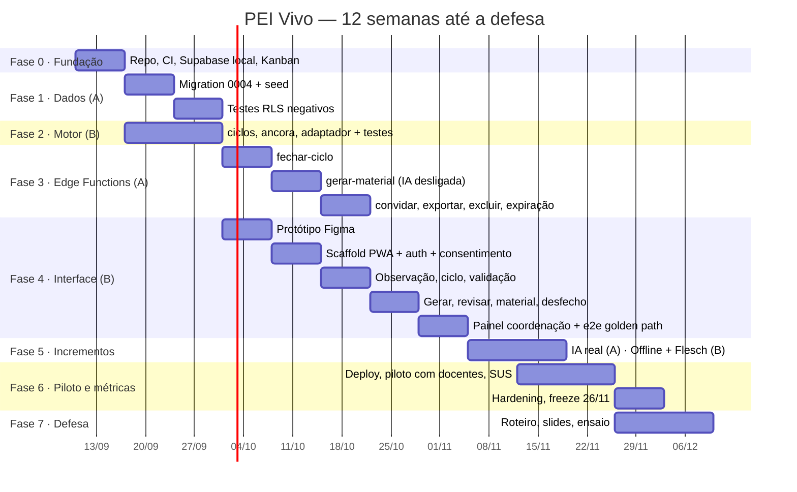

# PEI Vivo — Plano de desenvolvimento

**Versão:** 1.0 — 10/09/2026
**Horizonte:** 12 semanas (10/09 → 02/12/2026) + defesa em dezembro.
**Base:** `docs/requisitos.md` (decisões `D-nn`, histórias `HU-*`, backlog §9),
cronograma do pré-projeto (§12) e riscos (§10).

Este plano é o que vira o quadro Kanban. Cada card tem ID (`P<fase>.<n>`),
saída verificável e a linha da rastreabilidade que fecha. A ordem das fases
é a ordem inegociável do CLAUDE.md: **schema/RLS → motor → Edge Functions →
frontend**. Nada de tela antes da policy que protege o dado que ela mostra.

---

## 0. Como ler e usar este plano

**Semanas.** S1 começa quarta 10/09. Cada semana vai de quarta a terça.

| S1 | S2 | S3 | S4 | S5 | S6 | S7 | S8 | S9 | S10 | S11 | S12 |
|---|---|---|---|---|---|---|---|---|---|---|---|
| 10–16 set | 17–23 set | 24–30 set | 1–7 out | 8–14 out | 15–21 out | 22–28 out | 29 out–4 nov | 5–11 nov | 12–18 nov | 19–25 nov | 26 nov–2 dez |

**Capacidade assumida.** Dupla em curso noturno: ~12 h/semana por pessoa,
~290 h no total. O plano cabe nisso **se** a Fase 5 (IA real, offline) for
tratada como incremento, não como pré-requisito. O sistema tem que estar
demonstrável de ponta a ponta com IA desligada ao fim da Fase 4 — é o
"modo demo" do risco §10, e é o que prova que não é wrapper (RNF08).

**Duas frentes, revisão cruzada.** Kanban exige revisão do outro integrante
antes de "Concluído". Sugestão de divisão que permite paralelismo real:

| Frente | Foco | Fases |
|---|---|---|
| **A — Dados e servidor** | Migrations, RLS, testes negativos, Edge Functions, IA | 1, 3, 5a |
| **B — Motor e interface** | `motor-adaptacao`, protótipo, `apps/web`, PWA, acessibilidade | 2, 4, 5b |
| **Ambos** | Fundação, piloto, métricas, monografia, defesa | 0, 6, 7 |

A dupla decide quem é A e quem é B. O que importa é que cada PR seja revisado
por quem **não** o escreveu.

**Definition of Done (todo card).**
1. Teste automatizado cobrindo o critério de aceite da história.
2. PR revisado pelo outro integrante.
3. Linha correspondente em `docs/rastreabilidade.md` com o hash do commit.
4. `npm test` (motor) e testes RLS verdes no CI.

**Cadência.**
- Checkpoint da dupla: semanal, 30 min, terça (fim da semana do plano).
- Checkpoint com a orientadora: ao fim de cada fase (marcos M1–M6).
- WIP: máximo 2 cards por pessoa em "Em Desenvolvimento".

---

## 1. Visão geral (Gantt)



Marcos:

| Marco | Data | O que precisa ser verdade |
|---|---|---|
| **M0** | 16/09 | `supabase db reset` roda 0001–0003 sem erro; CI verde; Kanban populado |
| **M1** | 30/09 | 0004 aplicada; **todos** os testes RLS negativos verdes (docente × nota clínica é o primeiro) |
| **M2** | 30/09 | Motor completo (`regras`, `ciclos`, `ancora`, `adaptador`) com cobertura ≥ 70 % |
| **M3** | 21/10 | Fluxo completo via HTTP com IA desligada: cadastrar → consentir → observar → fechar ciclo → validar → gerar → aprovar → desfecho |
| **M4** | 04/11 | Golden path no Playwright (viewport móvel) verde; axe-core 0 violações A/AA |
| **M5** | 18/11 | IA real com fallback; geração < 60 s em rede móvel simulada |
| **M6** | 02/12 | Métricas do piloto tabuladas; ambiente de demo testado; freeze |

---

## 2. Fase 0 — Fundação (S1 · 10–16 set · ambos)

**Objetivo.** Sair de "pasta com arquivos" para "repositório com CI, banco
local funcionando e quadro Kanban". O README avisa que **as migrations nunca
rodaram num Postgres real** — este é o primeiro risco a eliminar.

**Pré-requisitos.** Node ≥ 20, conta GitHub e Supabase. **Docker não está
disponível na máquina de desenvolvimento** (virtualização do Windows), então
`supabase start` local está fora. Estratégia adotada:

- **Local:** migrations e seed validados em **PGlite** (Postgres 17 em WASM,
  `npm run db:validar`), com stub de `auth.uid()`. Testes de policy RLS
  também rodam aí (rápido, sem rede).
- **CI:** o runner Ubuntu tem Docker — `supabase start` + `db reset` rodam lá
  a cada push, validando o SQL no Postgres do Supabase de verdade.
- **Cloud:** projeto Supabase **de desenvolvimento** (`pei-vivo-dev`) para
  `db push`, Edge Functions e os testes que precisam do caminho
  PostgREST + JWT. Um segundo projeto (`pei-vivo-demo`) só na Fase 6.

| Card | Tarefa | Saída verificável |
|---|---|---|
| P0.1 | `git init`, `.gitignore` (node_modules, `.env*`, `supabase/.temp`), primeiro commit com o estado atual | Repo no GitHub, branch `main` protegida (PR obrigatório) |
| P0.2 | Monorepo com npm workspaces: `package.json` raiz com `"workspaces": ["packages/*", "apps/*"]`, `tsconfig.base.json` | `npm install` na raiz instala tudo; `npm test -w packages/motor-adaptacao` passa 7/7 |
| P0.3 | `npx supabase init` + `scripts/validar-migrations.mjs` (PGlite) rodando 0001→0002 + `seed.sql` | Zero erro de SQL. Se houver, corrigir **na própria migration** (ainda não foi para produção) — ✅ feito: 10 tabelas, 18 policies, RLS em todas |
| P0.4 | Criar projeto Supabase Cloud `pei-vivo-dev` (free), `supabase link`, `db push`, depois `db reset --linked` para carregar o seed | Migrations aplicadas no cloud; `project-ref` no `.env.example`; secrets `SUPABASE_URL`/`SUPABASE_ANON_KEY` no GitHub |
| P0.5 | CI GitHub Actions: job `motor` (typecheck + coverage + `db:validar`), job `db` (`supabase start` + `db reset` no runner — valida SQL a cada push), workflow de keep-alive | Badge verde no README — ✅ workflows escritos; verde após P0.1 (push) |
| P0.6 | GitHub Projects: 5 colunas (Backlog → A Fazer → Em Desenvolvimento → Revisão/Teste → Concluído), WIP 2/pessoa, um card por linha deste plano, labels `fase:N`, `frente:A/B`, `RF..`, `D-..` | Screenshot do quadro (vira o slide 3) |
| P0.7 | `docs/rastreabilidade.md` com o formato do quadro (RF · Texto · Motivação · Decisão · Teste · Commit), semeado a partir da §7 de `requisitos.md`, coluna Commit vazia | Arquivo versionado |
| P0.8 | Mover `notion/` para `docs/tcc/` (fontes do TCC versionadas) e apagar o `.zip` da raiz | Raiz limpa |

**Critério de saída (M0).** `git clone` + `npm install` + `supabase start` +
`supabase db reset` + `npm test` funcionam numa máquina limpa, seguindo só o
README.

**Risco tratado.** §10 "Supabase gratuito pausa por inatividade" → o CI faz
ping semanal no cloud (job agendado) a partir daqui.

---

## 3. Fase 1 — Dados: migration 0004 + testes RLS (S2–S3 · 17–30 set · frente A)

**Objetivo.** Fechar todas as decisões de dados de `requisitos.md` numa única
migration e provar, com testes que tentam o acesso **negado**, que a matriz
de permissões v2 está no banco.

### 3.1 Migration `0004_revisao_requisitos.sql`

| Card | Decisão | Conteúdo |
|---|---|---|
| P1.1 | D-13 | Enums `status_aprovacao`, `status_ciclo`, `status_vinculo`; `alter column … type … using …`; `check (papel <> 'PROFISSIONAL_SAUDE' or registro_conselho is not null)` |
| P1.2 | D-01 | `estudantes.laudo_apresentado_em date` |
| P1.3 | D-04 | `observacoes.papel_autor papel_usuario not null` + trigger `before insert` que preenche via `fn_meu_papel` |
| P1.4 | D-08 | `usuarios.papel_institucional papel_usuario`; `fn_cadastrar_estudante(nome, data_nascimento, turma) returns uuid security definer` |
| P1.5 | D-06 | Tabela `auditoria`; triggers em `consentimentos`, `versoes_perfil`, `materiais_adaptados`, `vinculos_usuario_estudante`; RLS: select para RESPONSAVEL (próprio estudante) e COORDENACAO; nenhum insert/update/delete via RLS |
| P1.6 | D-06 | `responsavel_gerencia_consentimento` → separar em `for select`, `for insert`, `for update`; **sem delete** |
| P1.7 | D-07 | `alter type status_validacao add value 'EXPIRADA'`; `versoes_perfil.justificativa_revisao text`; view `pendencias_validacao` |
| P1.8 | D-11 | Reescrever `vinculado_le_*` (7 policies) com `or fn_meu_papel(x) in ('RESPONSAVEL','COORDENACAO')` após revogação; adicionar `fn_tem_consentimento_ativo` em `papel_autorizado_registra_observacao` e `profissional_valida_versao` |
| P1.9 | D-12 | `vinculado_le_material` → docente vê tudo; demais só `APROVADO`. Mesma regra em `vinculado_le_desfecho` |
| P1.10 | — | Atualizar `supabase/seed.sql`: `papel_institucional` na coordenação, `papel_autor` nas observações, um material APROVADO + um RASCUNHO, um desfecho, `laudo_apresentado_em`. Continua 100 % fictício |

Regra: `supabase db reset` precisa continuar passando após cada card, não só
no fim.

### 3.2 Testes RLS negativos

**Ferramenta — duas camadas, em `packages/testes-rls/`.**

1. **PGlite + Vitest (local e CI, sem Docker).** Carrega migrations + seed
   num Postgres WASM, faz `set role authenticated` + `set_config('request.jwt.claim.sub', …)`
   para assumir cada papel e executa SQL direto. Testa a **lógica das
   policies** em milissegundos. A PoC de RN02 já rodou assim
   (docente → 0 linhas; insert barrado).
2. **supabase-js + Vitest contra `pei-vivo-dev` (cloud).** O critério de
   rastreabilidade diz *"chamada direta à API com token válido"* — só um teste
   que passa por PostgREST + JWT prova isso. O `setup` cria os 4 usuários via
   `auth.admin.createUser` (service role) e os liga aos `usuarios` do seed;
   roda com `supabase db reset --linked` antes. No CI, roda só em `main`
   (precisa dos secrets).

Todo teste da tabela abaixo existe nas duas camadas com o mesmo nome.

| Card | Testes (cada um começa pelo caminho NEGADO) |
|---|---|
| P1.11 | Infra: `globalSetup` PGlite (migrations + seed + 4 `auth.users`) e cliente cloud opcional; helpers `comoDocente()`, `comoResponsavel()`, …; `esperaNegado(promise)` que aceita 401/403/42501 **ou** 0 linhas |
| P1.12 | **RN02** — docente lê `notas_clinicas` → 0 linhas; docente insere → erro; responsável e coordenação idem. Profissional lê e escreve. *Primeiro teste verde do projeto.* |
| P1.13 | **RN01/RN08** — sem consentimento ATIVO: docente cria ciclo → erro; insere observação → erro; gera material → erro. Revogar e repetir → erro. Responsável e coordenação continuam lendo; docente e profissional recebem 0 linhas |
| P1.14 | **RF02/D-06** — responsável `delete` em `consentimentos` → erro; revogar gera linha em `auditoria`; docente lê `auditoria` → 0 linhas |
| P1.15 | **D-08** — usuário sem `papel_institucional` chama `fn_cadastrar_estudante` → erro; coordenação chama → estudante + vínculo na mesma transação; `insert into estudantes` direto → erro para todos |
| P1.16 | **D-12/RN04** — responsável lê material RASCUNHO → 0 linhas; após `APROVADO` → 1 linha; profissional `update` em `materiais_adaptados` → erro (RN07) |
| P1.17 | **RF14 vínculos** — docente cria vínculo → erro; docente vê só os próprios; coordenação desativa vínculo → o desativado perde leitura imediatamente |
| P1.18 | **D-04** — responsável insere observação com `autor_id` de outro → erro; `papel_autor` preenchido = RESPONSAVEL; coordenação insere → erro |
| P1.19 | **D-13** — vínculo PROFISSIONAL_SAUDE sem `registro_conselho` → violação de check |

**Critério de saída (M1).** Todos os testes acima verdes no CI. Cada um
referenciado na coluna *Teste* de `rastreabilidade.md`.

**Riscos.** Trigger `security definer` e `fn_meu_papel` com `limit 1`: um
usuário com dois papéis no mesmo estudante (ex.: coordenadora que também é
mãe) pega um papel arbitrário. Decidir em P1.3: proibir por `unique` já
existente (`usuario_id, estudante_id, papel` permite dois papéis) → adicionar
`unique (usuario_id, estudante_id)` e documentar como D-14.

---

## 4. Fase 2 — Motor completo (S2–S3 · 17–30 set · frente B)

**Objetivo.** O motor hoje converte observação → parâmetro. Faltam as duas
entradas que ninguém produz e a adaptação do texto em si. Tudo puro, sem I/O,
testável em milissegundos.

| Card | Módulo | Contrato | Testes obrigatórios |
|---|---|---|---|
| P2.1 | `src/ciclos.ts` | `calcularCiclosConsecutivos(historico: ObservacaoHistorica[]): Map<DimensaoObservada, number>` — conta, por dimensão, quantos ciclos consecutivos (do mais recente para trás) têm a mesma escala | AMPLIADA×3 → 3; AMPLIADA, ESTAVEL, AMPLIADA → 1; dimensão ausente no último ciclo → 0 |
| P2.2 | `src/ancora.ts` | `derivarInteresseAncora(observacoes, anterior: string \| null): string \| null` — última `INTERESSE_MANIFESTO`+`AMPLIADA`, `evidencia` normalizada; sem observação, mantém `anterior` | "Dinossauros!" → "dinossauros"; sem observação → mantém; nunca volta a `null` se já houve valor |
| P2.3 | `src/tipos.ts` | `TextoAdaptado = { blocos: Bloco[]; enunciados: Enunciado[]; parametros: ParametrosAdaptacao }`, `Bloco = { linhas: string[] }`, `Enunciado = { etapas: string[] }` — **estender** `tipos.ts`, não criar tipo paralelo | Compila |
| P2.4 | `src/adaptador.ts` | `adaptar(texto: string, p: ParametrosAdaptacao): TextoAdaptado` — segmenta parágrafos em blocos ≤ `maxLinhasPorBloco` (linha ≈ 60 caracteres), corta em `blocosPorMaterial`, detecta enunciados imperativos compostos ("leia … e depois …") e divide em etapas quando `formatoEnunciado = ETAPA_UNICA` | Mesma entrada → mesma saída; nenhum bloco excede o limite; texto original é recuperável por concatenação (nada se perde); `ETAPA_UNICA` nunca gera enunciado com "e depois"/"em seguida" |
| P2.5 | `src/index.ts` | Barrel exportando tudo; `package.json` com `"exports"` e `"type": "module"` | Importável de Node (Vitest) e de Deno (Edge Function) — **spike de 1 h**: testar `import` relativo de `supabase/functions/_shared/` |
| P2.6 | Cobertura | `vitest --coverage` no CI com threshold 70 % (RNF07) | CI falha abaixo de 70 % |
| P2.7 | Cenário A | Teste de integração do motor: seed do cenário A (3 observações do ciclo 3) → `aplicarCiclo` + `derivarInteresseAncora` reproduz exatamente o `parametros` de `supabase/seed.sql` | Verde |

**Critério de saída (M2).** `npm test -w packages/motor-adaptacao` verde,
cobertura ≥ 70 %, spike P2.5 respondido (documentar em `packages/motor-adaptacao/README.md`
como a Edge Function importa o motor).

**O que NÃO entra aqui.** Simplificação lexical e recontextualização — isso
é IA (Fase 5). Tipografia/contraste — isso é CSS no cliente (D-10, Fase 4).

---

## 5. Fase 3 — Edge Functions (S4–S6 · 1–21 out · frente A)

**Objetivo.** O Diagrama de Sequência vira código, mensagem por mensagem.
Ao final, o sistema inteiro funciona por HTTP, sem interface, com IA
desligada — é o modo demo.

**Estrutura.**
```
supabase/functions/
├── _shared/
│   ├── motor/            → import do packages/motor-adaptacao (conforme P2.5)
│   ├── auth.ts           → jwt → usuario_id + fn para checar papel/consentimento
│   ├── auditoria.ts      → registrar(entidade, id, evento, autor, detalhes)
│   ├── ia/
│   │   ├── ProvedorIA.ts     → interface
│   │   └── Desligada.ts      → retorna texto intacto
│   └── erros.ts          → respostas 400/401/403/409 padronizadas
├── fechar-ciclo/
├── gerar-material/
├── convidar-responsavel/
├── exportar-dados-estudante/
└── excluir-estudante/
```

### 5.1 `fechar-ciclo` (S4 · D-09, HU-D.02, HU-S.01, HU-S.02)

| Card | Passo |
|---|---|
| P3.1 | `_shared/auth.ts`: extrai `auth.uid()` do JWT, resolve `usuarios.id`, expõe `exigirPapel(estudanteId, papel)` e `exigirConsentimento(estudanteId)` — reutilizado por todas as funções |
| P3.2 | `fechar-ciclo`: body `{cicloId}` validado com Zod → exige DOCENTE + consentimento → carrega observações do ciclo e dos ciclos anteriores do estudante → `calcularCiclosConsecutivos` → `aplicarCiclo(vigente.parametros, observacoes)` → `derivarInteresseAncora` → decide status: `PENDENTE` se existe vínculo PROFISSIONAL_SAUDE ativo, senão `VIGENTE` (RN06) → insere `versoes_perfil` → `ciclos_observacao.status = FECHADO` → auditoria → responde `{versao, diff}` |
| P3.3 | Teste de integração (Vitest + `pei-vivo-dev`, ou `supabase functions serve` no CI): cenário A → versão gerada bate com o seed; sem profissional → `VIGENTE`; ciclo já fechado → 409; docente sem consentimento → 403 |

### 5.2 `gerar-material` (S5 · RF08–RF10, HU-D.03, HU-S.04, HU-S.05)

As 18 mensagens do diagrama viram a ordem do código:

| Msg | Card | Código |
|---|---|---|
| 2 | P3.4 | `POST` body `{texto, estudanteId}` — Zod: texto 1–20 000 chars |
| — | P3.4 | exige DOCENTE + consentimento (RN01/RN08) |
| 3–4 | P3.5 | `select … from versoes_perfil where estudante_id=? and status_validacao='VIGENTE' order by data_vigencia desc limit 1`; sem vigente → 409 "estudante sem perfil vigente" |
| — | P3.5 | Cache: `sha256(texto) + versao_perfil_id` → se já existe material com esse par, retorna o existente (risco §10 custo IA) |
| 5–6 | P3.6 | `adaptar(texto, parametros)` |
| 7–8 (alt) | P3.7 | `ProvedorIA.simplificar(textoAdaptado, parametros)` só se `IA_HABILITADA=true` **e** existe PROFISSIONAL_SAUDE vinculado (RN06); timeout 30 s; qualquer falha → segue com camada 1 + flag `iaAplicada:false` |
| 9–10 | P3.8 | `insert materiais_adaptados (…, versao_perfil_id, status_aprovacao='RASCUNHO', hash_texto)` — adicionar coluna `hash_texto` e `ia_aplicada boolean` em migration `0005` |
| 11 | P3.8 | Responde `{materialId, original, adaptado: TextoAdaptado, iaAplicada, duracaoMs}` |
| — | P3.9 | Instrumentação: `duracaoMs` logado — é o dado do RNF02 |
| 14–17 | — | `PATCH` de aprovação **não** precisa de função: é `update` direto via RLS (`docente_aprova_ou_descarta_material`), trigger de auditoria cobre |
| P3.10 | Testes: IA off → 200 com `iaAplicada:false`; sem vigente → 409; texto repetido → mesmo `materialId`; responsável chama → 403 |

### 5.3 Funções de ciclo de vida (S6 · D-05, D-07, D-08)

| Card | Função | Regras |
|---|---|---|
| P3.11 | `convidar-responsavel` | exige `papel_institucional=COORDENACAO`; `auth.admin.inviteUserByEmail`; cria `usuarios` + vínculo RESPONSAVEL; idempotente por e-mail |
| P3.12 | `exportar-dados-estudante` | exige RESPONSAVEL ou COORDENACAO vinculado; JSON com todas as tabelas **exceto** `notas_clinicas`; evento `EXPORTACAO` em auditoria |
| P3.13 | `excluir-estudante` | exige RESPONSAVEL; body com `confirmacao: nome do estudante`; `delete from estudantes` (cascata); evento `EXCLUSAO` sem dados pessoais (só id e data) |
| P3.14 | Expiração RN05 | Migration `0005`: `pg_cron` diário — `update versoes_perfil set status_validacao='EXPIRADA' where status_validacao='PENDENTE' and created_at < now() - interval '7 days'`. Teste: inserir PENDENTE com `created_at` de 8 dias atrás, rodar a função do cron manualmente, verificar EXPIRADA e que a VIGENTE anterior segue |
| P3.15 | Roteiro HTTP de demo | `docs/demo.http` (REST Client) ou script `scripts/demo.sh` que executa o fluxo inteiro: cadastrar → convidar → consentir → observar (3 autores) → fechar ciclo → validar → gerar → aprovar → desfecho → exportar |

**Critério de saída (M3).** P3.15 roda do zero (`db reset` + seed) até o fim
sem intervenção manual, com IA desligada. Tempo de `gerar-material` < 5 s
(sem IA). Todas as funções têm teste de 403 para o papel errado.

**Riscos.** Deno vs. Node no import do motor (mitigado por P2.5). Chave de
service role nunca no cliente: só em `supabase secrets set`.

---

## 6. Fase 4 — Protótipo e interface (S4–S8 · 1 out–4 nov · frente B)

**Objetivo.** Mobile-first, domingo 21h, celular. O docente não pode precisar
de mais que alguns toques. Interface só existe para dado já protegido por RLS
e já servido por Edge Function — por isso a Fase 4 começa uma semana depois
da 3 e as telas seguem a ordem em que o backend fica pronto.

### 6.1 Protótipo (S4 · 1–7 out)

| Card | Entrega |
|---|---|
| P4.1 | Figma, 375 px de largura, 6 telas: consentimento (R), observação quinzenal (D), fechar ciclo com diff (D), validar parâmetros (P), gerar + revisar lado a lado (D), material final web (D/R). Tokens de acessibilidade: dois temas de contraste (4.5 e 7), fonte ≥ 16 px, alvo de toque ≥ 44 px |
| P4.2 | Validar o protótipo com 2 docentes (pode ser informal, 15 min cada) — anotar o que confundiu. É insumo para RNF01 |

### 6.2 Scaffold e autenticação (S5 · 8–14 out)

| Card | Entrega |
|---|---|
| P4.3 | `npm create vite@latest apps/web -- --template react-ts`; Tailwind; TanStack Query; Zod; `@supabase/supabase-js`; `vite-plugin-pwa`; ESLint + `eslint-plugin-jsx-a11y` |
| P4.4 | Auth: login por e-mail/senha e aceite de convite (link do `inviteUserByEmail`); `useUsuario()` que resolve `usuarios` + vínculos; roteamento por papel (um layout por perfil, sem "modo admin") |
| P4.5 | Design system mínimo: `Botao`, `Campo`, `Escala3` (REDUZIDA/ESTÁVEL/AMPLIADA com rótulos leigos por dimensão), `Bloco` (renderiza `TextoAdaptado` com CSS vars derivadas de `parametros` — D-10) |
| P4.6 | Tela: **consentimento** (HU-R.01/R.02) — termo em linguagem simples, escopos, botão único; revogação com dupla confirmação; mostra trilha de auditoria |
| P4.7 | axe-core no Vitest (`vitest-axe`) para cada componente + Playwright com `@axe-core/playwright` para cada tela |

### 6.3 Ciclo de observação e validação (S6 · 15–21 out)

| Card | Entrega |
|---|---|
| P4.8 | Tela: **observação quinzenal** (HU-D.01, HU-R.03, HU-P.02) — 6 dimensões, `Escala3`, evidência opcional; mesma tela para os 3 papéis, muda só o rótulo; < 60 s no celular (medir com Playwright) |
| P4.9 | Tela: **fechar ciclo** (HU-D.02) — chama `fechar-ciclo`, mostra o diff vigente → proposto, sinaliza "aguardando 2º ciclo" (RN03) e "modo pedagógico" (RN06) |
| P4.10 | Tela: **validar parâmetros** (HU-P.01) — conjunto completo, observações de origem, aprovar / solicitar ajuste com justificativa; nunca mostra material (RN07) |
| P4.11 | Tela: **nota clínica** (HU-P.03) — visualmente separada ("só profissionais de saúde veem") |

### 6.4 Material (S7 · 22–28 out)

| Card | Entrega |
|---|---|
| P4.12 | Tela: **gerar** (HU-D.03) — textarea, seletor de estudante, botão "adaptar para [nome]"; estado de progresso com `duracaoMs`; aviso quando `iaAplicada:false` |
| P4.13 | Tela: **revisar** (HU-D.04) — original × adaptado (empilhado no celular, lado a lado em ≥ 768 px), edição inline do adaptado, aprovar / descartar |
| P4.14 | Tela: **material final** (HU-D.05) — web acessível com CSS a partir de `parametros`; `@media print` (RF12); glossário ao toque quando houver |
| P4.15 | Tela: **desfecho** (HU-D.06) — 3 botões + texto livre; 2 toques |
| P4.16 | Tela: **histórico do responsável** (HU-R.04) — só APROVADOS com desfecho |

### 6.5 Coordenação e golden path (S8 · 29 out–4 nov)

| Card | Entrega |
|---|---|
| P4.17 | Painel **coordenação**: cadastrar estudante (RPC), convidar responsável, vincular docente/profissional (com `registro_conselho` obrigatório), desativar vínculo, `laudo_apresentado_em` |
| P4.18 | Painel: **pendências** (view `pendencias_validacao`) e **histórico do PEI** (linha do tempo, botão exportar) |
| P4.19 | Playwright **golden path** em viewport 375×812: coordenação cadastra → responsável consente → docente observa → fecha ciclo → profissional valida → docente gera, revisa, aprova → registra desfecho → responsável vê. Roda no CI contra o Supabase do runner (Docker) e localmente contra `pei-vivo-dev` |
| P4.20 | Playwright **caminhos negados** na UI: docente não vê link para nota clínica; responsável não vê rascunho; sem consentimento, botão "adaptar" desabilitado **e** a chamada direta retorna 403 |

**Critério de saída (M4).** P4.19 e P4.20 verdes no CI; axe-core 0 violações
A/AA em todas as telas; Lighthouse PWA "instalável".

**Cortável se apertar.** HU-C.05 (indicadores agregados). P4.16 pode virar
lista simples.

---

## 7. Fase 5 — Incrementos: IA real e offline (S9–S10 · 5–18 nov)

Só começa com M3 e M4 fechados. Cada item é independente e pode ser cortado
sem quebrar a demo.

### 7.1 Frente A — camada de IA (RF10, HU-S.05)

| Card | Entrega |
|---|---|
| P5.1 | `ProvedorIA` real: chamada à API de LLM (modelo capaz de seguir instruções estruturadas; chave via `supabase secrets`). Prompt recebe `parametros` + texto; pede (a) simplificação lexical para `nivelVocabulario` com glossário `{termoOriginal, substituto}`, (b) recontextualização de exemplos com `interesseAncora`, (c) **proibição explícita** de alterar conteúdo conceitual, números, nomes próprios |
| P5.2 | Saída validada por Zod: `{texto, glossario[]}`; falha de schema → fallback camada 1 (nunca erro para o docente) |
| P5.3 | Limite por usuário (ex.: 30 gerações/dia) em tabela `cotas_ia`; cache já existe (P3.5) |
| P5.4 | Teste com IA ligada: glossário presente; conceitos preservados (asserção: números e nomes próprios do original aparecem no adaptado) |
| P5.5 | Chave de "IA desligada" no painel da coordenação (variável por instituição) — é o botão do modo demo |

### 7.2 Frente B — offline e legibilidade (RNF05, métrica Flesch)

| Card | Entrega |
|---|---|
| P5.6 | Service Worker (`vite-plugin-pwa` + Workbox): cache de leitura de materiais APROVADOS e do shell. **Sem** fila de envio (cortado, §10) |
| P5.7 | Teste: Playwright com `context.setOffline(true)` abre material já visto |
| P5.8 | `packages/motor-adaptacao/src/legibilidade.ts`: índice Flesch adaptado PT-BR (fórmula de Martins et al.) — puro, testado; usado na tela de revisão ("antes 42 → depois 61") e na coleta de métricas |
| P5.9 | Simulação de rede móvel no Playwright (throttling "Slow 4G"): `gerar-material` com IA < 60 s (RNF02) |

**Critério de saída (M5).** P5.4, P5.7, P5.9 verdes. IA desligada continua
passando todo o resto.

---

## 8. Fase 6 — Piloto, métricas e hardening (S10–S12 · 12 nov–2 dez · ambos)

**Objetivo.** As metas quantitativas do pré-projeto §11.2 são compromisso
com a banca. Esta fase produz os números.

| Card | Entrega | Meta (§11.2) |
|---|---|---|
| P6.1 | Deploy: `apps/web` na Vercel, Edge Functions e migrations no Supabase Cloud, `secrets` configurados, domínio | — |
| P6.2 | Script `scripts/seed-demo.ts` que recria o cenário do Miguel no cloud em 1 comando (dados fictícios) | Risco §10: ambiente 48 h antes |
| P6.3 | Recrutar 3–5 docentes individuais (não depende de escola parceira, §10). Termo de participação simples; nenhum dado de aluno real — eles usam o estudante fictício | ≥ 5 materiais por docente |
| P6.4 | Cronometragem comparativa: mesmo texto, adaptação manual × PEI Vivo, 3 textos por docente | Redução ≥ 80 % |
| P6.5 | Escala SUS aplicada após o uso (Google Forms) | ≥ 68 |
| P6.6 | Flesch antes/depois em todos os materiais gerados (P5.8) | ≥ +15 |
| P6.7 | Relatório axe-core + sessão manual com NVDA nas 6 telas principais | 0 violações A/AA |
| P6.8 | Relatório dos testes RLS negativos (P1.11–P1.19) + P4.20 | 100 % bloqueadas |
| P6.9 | Desfechos registrados no piloto: taxa ALCANÇADO com vs. sem âncora | Superior ao não adaptado |
| P6.10 | `duracaoMs` de todas as gerações do piloto, p95 | < 60 s |
| P6.11 | Relatório de cobertura do Vitest (motor + testes-rls + web) | ≥ 70 % |
| P6.12 | **Freeze de features em 26/11.** Só bug fix depois. Branch `demo` congelada e testada do zero em 30/11 e 01/12 |
| P6.13 | Tabular tudo em `docs/resultados.md` — vira o capítulo de resultados |

**Critério de saída (M6).** `docs/resultados.md` com as 9 métricas
preenchidas; ambiente de demo testado duas vezes em dias diferentes.

---

## 9. Fase 7 — Defesa (S12 + dezembro · ambos)

| Card | Entrega |
|---|---|
| P7.1 | Roteiro de demo de 8 min **abrindo pelo Miguel** (§14): consentimento da Dona Rosa → observações dos três → fechar ciclo → Camila valida → Márcia gera no celular (projetar o celular) → revisa e aprova → registra desfecho → histórico da coordenação. Mostrar IA desligada **e** ligada |
| P7.2 | Demo de segurança ao vivo: como docente, `curl` direto em `notas_clinicas` com token válido → 403. É a resposta a "Supabase não é só configurar um produto?" |
| P7.3 | Plano B: vídeo gravado da demo completa + segundo projeto cloud (`pei-vivo-demo`) já semeado + build do PWA em cache no notebook. Sem Docker local, não há "ambiente offline" — o vídeo é o fallback real |
| P7.4 | Slides finais a partir de `PEI_Vivo_Slides_Mapeamento.md` + números de `resultados.md`; screenshot real do Kanban (slide 3); matriz de rastreabilidade com commits (slide 6) |
| P7.5 | Ensaio cronometrado ×2 com a orientadora |

---

## 10. Trilha paralela — monografia (ago–nov, ambos)

A escrita acompanha as fases; cada marco fecha um capítulo.

| Capítulo | Fonte | Pronto após |
|---|---|---|
| Introdução, problema, justificativa, base legal | Pré-projeto §1–2 | S2 |
| Referencial teórico (PEI, UDL, WCAG, LGPD, Lei 14.254) | Pré-projeto §15 | S4 |
| Trabalhos relacionados | `PEI_Vivo_Slides_Mapeamento.md` §2 | S4 |
| Metodologia (Kanban, rastreabilidade, ISO 25010) | Slides §3, §6, §7 | S5 |
| Requisitos e decisões de projeto | `docs/requisitos.md` | M1 |
| Arquitetura e modelo de dados | Diagramas + `0001`–`0005` | M3 |
| Implementação (motor, RLS, Edge Functions, PWA) | Código + `rastreabilidade.md` | M4 |
| Resultados | `docs/resultados.md` | M6 |
| Conclusão e trabalhos futuros (geração pelo profissional, fila offline, auditoria de leitura, indicadores) | Cortes documentados em `requisitos.md` | S12 |

---

## 11. Riscos do §10 → onde cada um é tratado

| Risco | Mitigação | Card |
|---|---|---|
| Supabase gratuito pausa | Ping semanal no CI + seed de demo em 1 comando + teste 48 h antes | P0.5, P6.2, P6.12 |
| Custo por chamada de IA | Cache por hash + cota diária + IA desligada por padrão em dev | P3.5, P5.3, P5.5 |
| API externa cai na apresentação | Modo demo com IA desligada existe desde M3; materiais já gerados no banco; vídeo | P3.15, P7.3 |
| Escopo offline estoura | Só cache de leitura; fila de envio cortada | P5.6 |
| Sem escola parceira | Piloto com docentes individuais e estudante fictício | P6.3 |
| **Novo:** prazo de 12 semanas com 2 pessoas | Fase 5 inteira é incremento; HU-C.05 cortável; freeze em 26/11 | §0, P6.12 |
| **Novo:** dois papéis para o mesmo usuário no mesmo estudante | `unique (usuario_id, estudante_id)` — D-14 | P1.3 |
| **Novo:** sem Docker na máquina de desenvolvimento | PGlite local + Docker só no CI + projeto cloud de dev | P0.3, P0.5, P1.11 |

---

## 12. Estado (atualizado em 14/09/2026)

| Card | Estado |
|---|---|
| P0.1 | ✅ repo local · ⏳ criar repositório no GitHub e proteger `main` |
| P0.2 | ✅ workspaces (`packages/*`, `apps/*`), TS estrito, cobertura com threshold |
| P0.3 | ✅ migrations + seed validados em PGlite (10 tabelas, 18 policies) |
| P0.4 | ⏳ precisa de conta Supabase (criar `pei-vivo-dev`, link, push, secrets) |
| P0.5 | ✅ workflows escritos (jobs `motor`, `db`, `web`) · ⏳ verdes no primeiro push |
| P0.6 | ⏳ precisa do repositório no GitHub (`scripts/criar-kanban.sh`) |
| P0.7 | ✅ `docs/rastreabilidade.md` |
| P0.8 | ✅ `docs/tcc/`, zip removido |
| **P2.1–P2.5** | ✅ `ciclos.ts`, `ancora.ts`, `adaptador.ts`, `index.ts`, `exports` — 30 testes, 97 % (D-18) |
| P2.6 | ✅ threshold 70 % no CI |
| P2.7 | ✅ cenário A reproduzido (`regras.test.ts`) |
| **P4.1** | ✅ substituído por protótipo em código (`apps/web`) — 19 telas, design system em CSS (D-15), `docs/ux-ui.md` |
| P4.2 | ⏳ validar com 2 docentes (roteiro em `docs/plano-de-testes.md` §2) |
| P4.3 | ✅ scaffold Vite + React + TS (sem Tailwind/TanStack — D-15/D-17; sem PWA plugin ainda) |
| P4.4 | 🟡 sessão em contexto (`useSessao`) com modo demonstração (D-16); Supabase Auth pendente |
| P4.5 | ✅ `Botao`, `Campo`, `Escala3`, `MaterialAdaptado` (+ `Modal`, `Alerta`, `Badge`, `Card`, estados) |
| P4.6 | ✅ tela consentimento |
| P4.7 | ✅ axe-core no Vitest em todos os componentes e telas (jsdom); Playwright pendente |
| P4.8–P4.11 | ✅ observar, fechar ciclo, validar, nota clínica |
| P4.12–P4.16 | ✅ gerar, revisar, material (+ impressão), desfecho, histórico |
| P4.17–P4.18 | ✅ cadastrar, vínculos, pendências, histórico com exportação |
| P4.19–P4.20 | 🟡 equivalentes em jsdom (`paginas.test.tsx`, `mockApi.test.ts`); Playwright contra Supabase pendente |

**Ordem preservada.** O protótipo roda sobre `mockApi` (D-17), que aplica a
matriz de permissões v2; a Fase 1 (migration `0004` + RLS) e a Fase 3 (Edge
Functions) continuam pré-requisito de `supabaseApi`. Os 34 cenários de
`mockApi.test.ts` são a especificação dos testes P1.11–P1.19.

Próxima ação: P0.1 (GitHub) → P0.6 (Kanban) → P0.4 (Supabase dev) → Fase 1.
