# Diagrama de classes v3 (após R1, migrations 0001–0005)

**Atenção para o artigo:** `docs/tcc/class_diagram.svg` está **desatualizado** em relação ao código. Este diagrama em Mermaid é a referência até a dupla redesenhar o SVG/PNG na ferramenta original. Divergências em relação ao diagrama do artigo:

| Mudança | Decisão |
|---|---|
| + `Escola`, `MembroEscola` (coordenação e docente como membros da escola) | D-23 |
| `VinculoUsuarioEstudante`: sem papel COORDENACAO; ciclo de vida `PENDENTE_RESPONSAVEL → ATIVO → ENCERRADO`; confirmação, conferência e verificação de registro | D-21, D-24, D-25 |
| `Consentimento`: `escopos[]` + `versaoTermo` + `revogadoPor` | D-27 |
| `VersaoPerfil`: `origem`, `versaoAnterior`, `justificativa`; status + `EXPIRADA`, `SUBSTITUIDA`; uma só VIGENTE | D-35 |
| `ParametrosAdaptacao` com 6 campos (inclui `blocosPorMaterial`) | D-13 |
| + `NotaClinica` (já existia no schema), `Auditoria`, `Notificacao`, `Convite` | D-30, D-28, D-32 |
| `Estudante.laudoApresentadoEm` (só a data) | D-01, D-33 |
| `Observacao.papelAutor` | D-04 |

```mermaid
classDiagram
  direction LR
  class Escola { +uuid id; +string nome }
  class MembroEscola { +PapelEscola papel  «COORDENACAO|DOCENTE»; +StatusMembro status }
  class Usuario { +uuid id; +string nome; +string email; +uuid authUserId }
  class Estudante { +uuid id; +string nome; +date dataNascimento; +string turma; +date laudoApresentadoEm «só a data» }
  class VinculoUsuarioEstudante {
    +PapelUsuario papel «RESPONSAVEL|DOCENTE|PROFISSIONAL_SAUDE»
    +StatusVinculo status «PENDENTE_RESPONSAVEL|ATIVO|RECUSADO|ENCERRADO»
    +string registroConselho
    +VerificacaoRegistro verificacao
    +propostoPor / confirmadoPor / conferidoPor / encerradoPor
  }
  class Consentimento { +EscopoConsentimento[] escopos; +string versaoTermo; +StatusConsentimento status; +datetime dataConcessao; +datetime dataRevogacao }
  class CicloObservacao { +int numero; +StatusCiclo status «ABERTO|FECHADO» }
  class Observacao { +DimensaoObservada dimensao; +EscalaObservacao valorEscala; +string evidencia; +PapelUsuario papelAutor }
  class VersaoPerfil { +int numeroCiclo; +StatusValidacao status «PENDENTE|VIGENTE|EM_REVISAO|EXPIRADA|SUBSTITUIDA»; +OrigemVersao origem; +string justificativa }
  class ParametrosAdaptacao { «value object» +int maxLinhasPorBloco; +NivelVocabulario nivelVocabulario; +string interesseAncora; +FormatoEnunciado formatoEnunciado; +4.5|7 contrasteMinimo; +int blocosPorMaterial }
  class MaterialAdaptado { +string titulo; +string textoOriginal; +string textoRevisado; +StatusAprovacao status; +bool iaAplicada }
  class Desfecho { +ResultadoDesfecho resultado; +string observacaoLivre }
  class NotaClinica { +string conteudo «leitura só via RPC auditada» }
  class Auditoria { «append-only» +string evento; +string papelAutor; +jsonb detalhes }
  class Notificacao { +TipoNotificacao tipo; +datetime lidaEm }
  class Convite { +string email; +PapelUsuario papel; +datetime expiraEm; +datetime aceitoEm }

  Escola "1" --> "*" Estudante
  Escola "1" --> "*" MembroEscola
  Usuario "1" --> "*" MembroEscola
  Usuario "1" --> "*" VinculoUsuarioEstudante
  Estudante "1" --> "*" VinculoUsuarioEstudante
  Estudante "1" --> "*" Consentimento : concedido por RESPONSAVEL
  Estudante "1" --> "*" CicloObservacao
  CicloObservacao "1" --> "*" Observacao
  Estudante "1" --> "*" VersaoPerfil
  VersaoPerfil *-- ParametrosAdaptacao
  VersaoPerfil --> VersaoPerfil : versaoAnterior
  MaterialAdaptado --> VersaoPerfil : snapshot (VIGENTE na geração)
  Estudante "1" --> "*" MaterialAdaptado
  MaterialAdaptado "1" --> "0..1" Desfecho
  Estudante "1" --> "*" NotaClinica
  Usuario "1" --> "*" Notificacao
  Escola "1" --> "*" Convite
```

