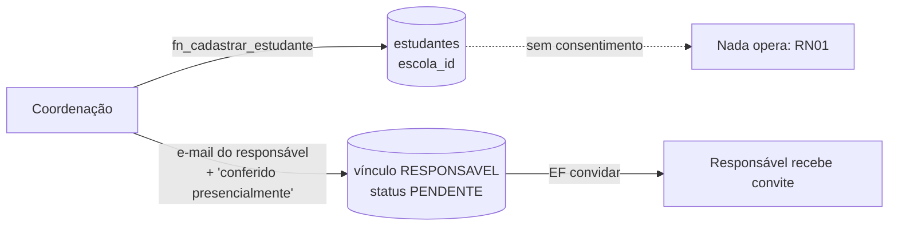
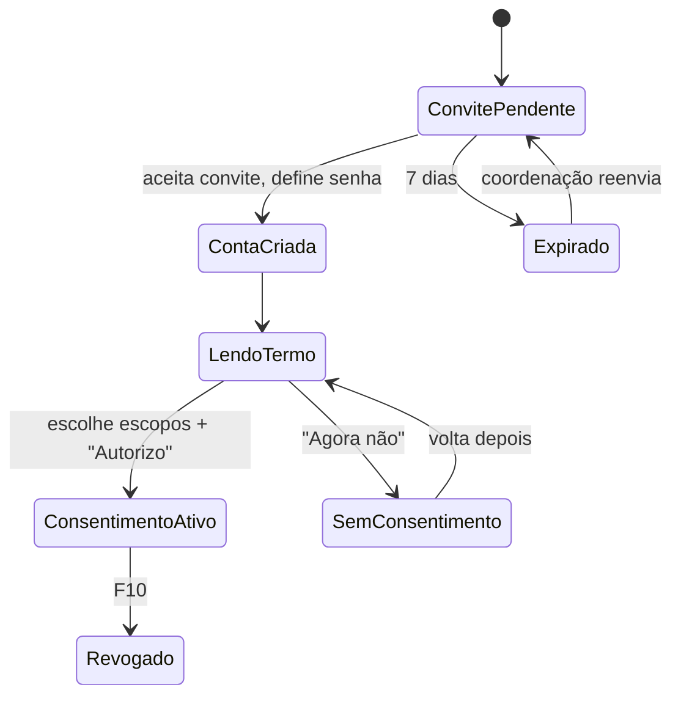
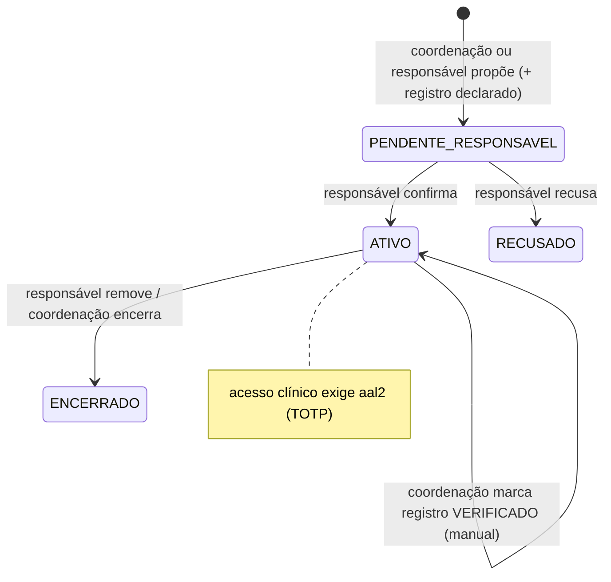
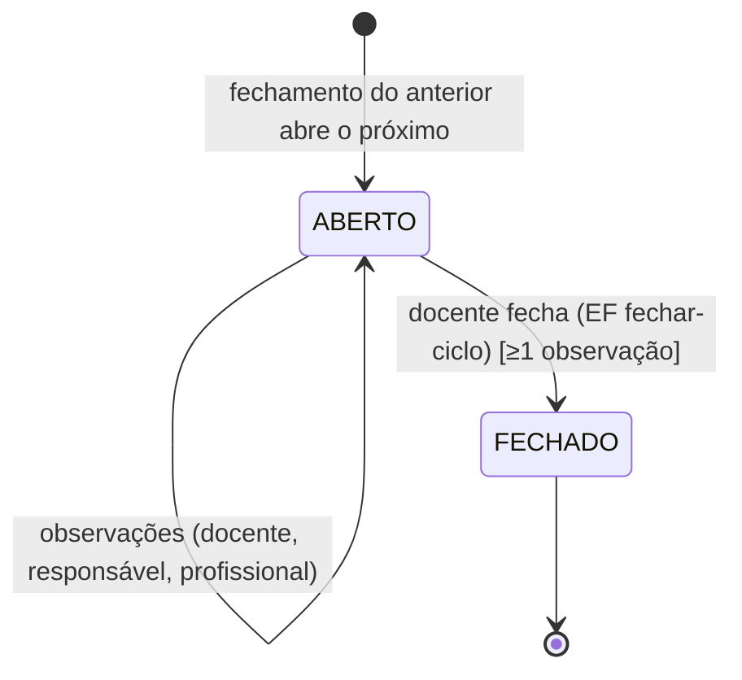
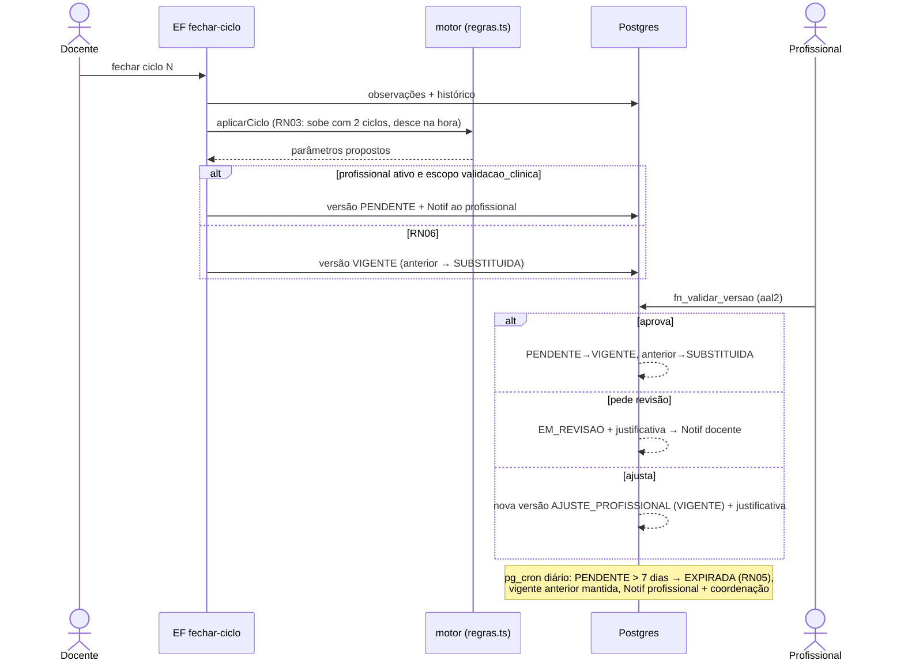
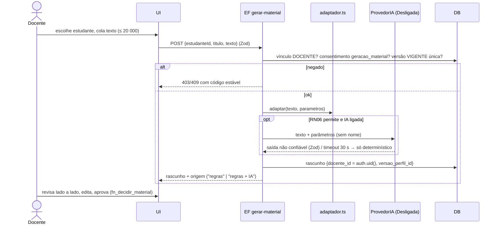
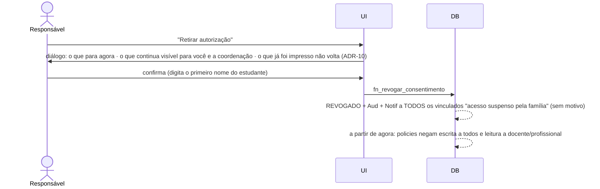

# Fase 0 · Fluxos ponta a ponta

**Data:** 07/10/2026 · Assume as recomendações de `DECISOES.md`. Onde um fluxo depende de uma decisão do usuário ainda aberta (ADR-04/05/06), isso está marcado com **⚑**.
Convenção: **EF** = Edge Function (service role), **RPC** = função `security definer`, **Aud** = evento gravado em `auditoria`, **Notif** = linha em `notificacoes` (ADR-09).

Fluxos novos, que o prompt não listava: **F15** (perda do dispositivo TOTP) e **F16** (consentimento pendente: o estudante existe e nada opera).

---

## F1 · Implantação da escola ⚑ADR-04

```mermaid
sequenceDiagram
  actor Op as Operador (dupla)
  participant S as scripts/implantar-escola.ts (service role)
  participant DB as Postgres
  participant A as Supabase Auth
  actor C as 1º coordenador
  Op->>S: nome da escola + e-mail
  S->>DB: insert escolas, convites(papel=COORDENACAO)
  S->>A: inviteUserByEmail
  A-->>C: e-mail de convite (validade 7 dias)
  C->>A: define senha + aceita termos (versão)
  C->>A: ativa TOTP (obrigatório, ADR-13)
  A-->>DB: trigger cria usuarios + membros_escola(COORDENACAO)
```

| Item | Conteúdo |
|---|---|
| Pré-condição | Nenhuma escola com o mesmo nome |
| Bloqueia | Sem TOTP ativo, o coordenador não lê nem escreve dado administrativo (aal2) |
| Aud | `ESCOLA_CRIADA`, `CONVITE_EMITIDO`, `CONVITE_ACEITO` |
| Falhas | Convite expira → `implantar-escola --reenviar` invalida o anterior (`convites.revogado_em`). E-mail errado → reenvio com e-mail corrigido; o antigo é revogado |

## F2 · Cadastro do estudante

| Item | Conteúdo |
|---|---|
| Ator | Coordenação (aal2) |
| Dados | nome, nascimento, turma, `laudo_apresentado_em` opcional. **Nada de aprendizagem** |
| RN | RN01 (nada opera), ADR-06 (conferência presencial) |
| Falhas | **Responsável já tem conta** → vínculo criado direto e Notif "novo estudante para confirmar", sem novo convite. **Dois filhos na escola** → mesmo usuário, dois vínculos, dois consentimentos (um por estudante). **Duplicidade** (mesmo nome + nascimento na escola) → aviso, sem bloquear |
| Aud | `ESTUDANTE_CADASTRADO`, `VINCULO_PROPOSTO(RESPONSAVEL)` |

## F3 · Convite e consentimento do responsável

| Item | Conteúdo |
|---|---|
| Termo | O que é coletado · quem vê o quê (matriz v3 em linguagem leiga) · o que **não** é coletado (laudo, diagnóstico) · por quanto tempo · direitos (exportar, excluir, revogar) · versão do termo |
| Escrita | `fn_conceder_consentimento(estudante, escopos[], versao_termo)` (ADR-08) |
| RN | RN01, RN08 |
| Notif | Coordenação: "consentimento concedido" (sem escopos). Docente: "estudante disponível" |
| Aud | `CONSENTIMENTO_CONCEDIDO {escopos, versao_termo}` |
| Falhas | Ignora o convite → lembretes no dia 3 e no dia 6 (por e-mail do Auth não é possível; **[SUPOSIÇÃO]** sem e-mail transacional, o lembrete é a coordenação reenviando). A coordenação vê "Aguardando responsável" **sem** dado de aprendizagem (não há nenhum) |

## F4 · Vínculo de docente
| Passo | Detalhe |
|---|---|
| 1 | Coordenação convida o docente para a escola (EF `convidar`, papel `DOCENTE`), se ainda não for membro |
| 2 | Coordenação vincula o docente ao estudante (`fn_vincular_docente`) |
| 3 | O docente vê o estudante em "Minha turma". Com consentimento, lê o perfil vigente e observa. Sem consentimento, vê só o nome e "Aguardando autorização da família" |
| RN | RN01, RN02 (nunca nota clínica), ADR-02 (um papel por estudante) |
| Aud / Notif | `VINCULO_CRIADO(DOCENTE)` / docente: "novo estudante na sua turma" |
| Falhas | Docente já vinculado → `unique_violation` → mensagem "já está vinculado". Docente sai da escola → coordenação encerra todos os vínculos dele (F12) |

## F5 · Vínculo de profissional de saúde ⚑ADR-05

| Item | Conteúdo |
|---|---|
| Bloqueia | Proposta para si mesmo; profissional sem TOTP lendo nota ou validando; sem consentimento `validacao_clinica` → **RN06** (modo pedagógico) |
| Docente | Sem profissional ativo, o perfil mostra "Modo pedagógico: os ajustes vêm das observações da escola e da família, sem validação clínica", em tom informativo, sem alerta vermelho |
| Notif | Responsável: "confirme o profissional". Profissional: "acesso liberado" |
| Aud | `VINCULO_PROPOSTO`, `VINCULO_CONFIRMADO/RECUSADO`, `REGISTRO_VERIFICADO` |

## F6 · Ciclo quinzenal

| Item | Conteúdo |
|---|---|
| Observar | Uma tela, 6 dimensões × 3 opções (escolha segmentada, alvo ≥ 44 px), evidência opcional, **meta < 60 s** (medida com Playwright e cronômetro no piloto) |
| RN | RN01/RN08 (escopo `observacao_pedagogica` ou `observacao_domiciliar`), ciclo fechado não aceita observação |
| Notif | Docente: no 12º dia do ciclo, "faltam observações de N estudantes" (tarefa diária) |
| Falhas | **Docente não observa no prazo** → o ciclo segue aberto, sem fechamento automático (não se inventa dado); o painel da coordenação mostra "ciclo atrasado". **Estudante sem observação** → fechar é bloqueado. **Docente substituído no meio** → o vínculo antigo é encerrado; as observações dele permanecem com `papel_autor`, e o novo docente continua o mesmo ciclo. **Conexão ruim** → rascunho em memória e reenvio (ADR-10) |

## F7 · Conversão e validação clínica

| Item | Conteúdo |
|---|---|
| Tela do profissional | Vigente × proposto lado a lado, com destaque do que mudou e do que está "aguardando 2º ciclo" (RN03); observações do ciclo com autor; prazo restante. Pensada para 2–3 min |
| RN | RN03, RN05, RN06, RN07 (nunca material individual) |
| Aud | `VERSAO_PROPOSTA`, `VERSAO_VALIDADA/REVISAO/AJUSTADA/EXPIRADA` |
| Falhas | Profissional abre depois da expiração → "este ciclo expirou; o próximo fechamento trará nova proposta" (não se aprova versão antiga, ADR-16). Dois profissionais → o primeiro que decide vale; o segundo vê a decisão |

## F8 · Geração de material

| Falha | Comportamento |
|---|---|
| Consentimento revogado durante a revisão | Aprovar → 403 → tela "A família retirou a autorização. Este rascunho não pode ser usado." O rascunho fica inacessível (RN08) |
| IA fora do ar | Resposta só com a camada de regras e o aviso "assistência de IA indisponível agora" (não é erro) |
| Texto grande | Validação no cliente e no servidor (mesmo schema Zod) |
| Parâmetros em revisão | Gera com a **vigente** e mostra "uma revisão do perfil está em andamento" |
| Exportar | Página web acessível com CSS derivado dos parâmetros + `@media print` (já existe) |

## F9 · Desfecho
Docente registra `ALCANCADO | PARCIAL | NAO_ALCANCADO` em dois toques, com observação opcional. Só em material **aprovado** e só pelo autor (trigger, S-23). Alimenta o histórico, que o motor lê no próximo ciclo. Aud: não (é dado pedagógico, não evento sensível).

## F10 · Revogação de consentimento

| Item | Conteúdo |
|---|---|
| RN | RN08, RN01, D-11 |
| Retenção | Começa a contar o prazo de retenção (proposta: 12 meses após revogação sem reconcessão → a coordenação recebe a tarefa de exclusão). **[DECISÃO a confirmar com a orientadora]** |
| ⚑ADR-06 | Qualquer responsável revoga; reconceder notifica os demais |

## F11 · Exportação e exclusão (RF15)
| Etapa | Detalhe |
|---|---|
| Exportar | EF `exportar-dados-estudante`: JSON legível + resumo HTML imprimível, **sem** notas clínicas (D-05). Aud `EXPORTACAO` |
| Pedir exclusão | Responsável pede → ⚑ADR-06 (todos os responsáveis confirmam em 7 dias) → período de arrependimento de **7 dias** (o pedido pode ser cancelado) → EF `excluir-estudante` apaga em cascata, **incluindo notas clínicas** (D-05) |
| O que fica | Eventos de `auditoria` com `estudante_id`, sem nome nem conteúdo, para prova de cumprimento (LGPD art. 16, I). A tela explica isso antes da confirmação |

## F12 · Troca de docente, virada de ano, transferência
Encerramento em lote dos vínculos de docente por turma; perfil e histórico preservados; novo vínculo. Transferência: fora do escopo (ADR-17). Aud `VINCULO_ENCERRADO`.

## F13 · Conta e segurança
Trocar senha (exige reautenticação) · ativar e trocar TOTP · "sair de todos os dispositivos" · ver as sessões ativas **[SUPOSIÇÃO: o Supabase não expõe a lista de sessões ao cliente; se não expuser, a tela mostra só "sair de todos"]** · excluir a própria conta: permitido para quem não é o último responsável ativo de um estudante nem o último coordenador da escola. Os registros feitos continuam com `autor_id` anonimizado ("pessoa removida").

## F14 · Falha e recuperação
| Situação | Comportamento |
|---|---|
| Sem internet | Shell abre; telas mostram "Sem conexão. Nada foi perdido do que você já salvou." Observação em edição fica em memória e é reenviada |
| Sessão expira com formulário aberto | Diálogo de reautenticação **sobre** a tela (o formulário fica preservado em memória) e reenvio |
| 403 | Estado "negado" com motivo em linguagem simples e saída ("Voltar para Meus estudantes") |
| 404 / manutenção | Página própria; a manutenção usa um banner a partir de uma variável de ambiente do build |

## F15 · Perda do dispositivo TOTP (novo)
Profissional ou coordenador perde o celular → pede à coordenação (ou, para o 1º coordenador, à dupla via script) → identidade conferida presencialmente → `fn_redefinir_mfa(usuario)` (service role) remove o fator → próximo login exige novo cadastro de TOTP. Aud `MFA_REDEFINIDO`. Notif ao próprio usuário.

## F16 · Estudante sem consentimento (novo)
Estado legítimo e longo: o estudante existe, a família não autorizou. Coordenação vê "Aguardando autorização" com data do convite e botão de reenvio. Docente vê o nome e "Aguardando autorização da família", sem ação disponível. Nenhuma notificação de cobrança à família além dos reenvios manuais (sem padrão enganoso).
