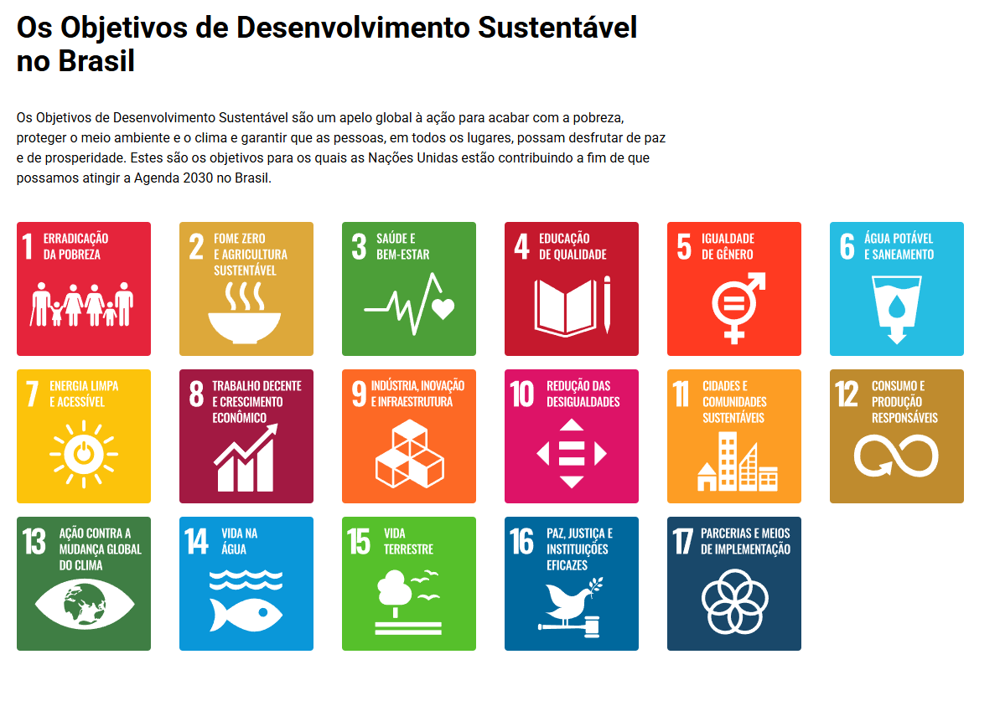
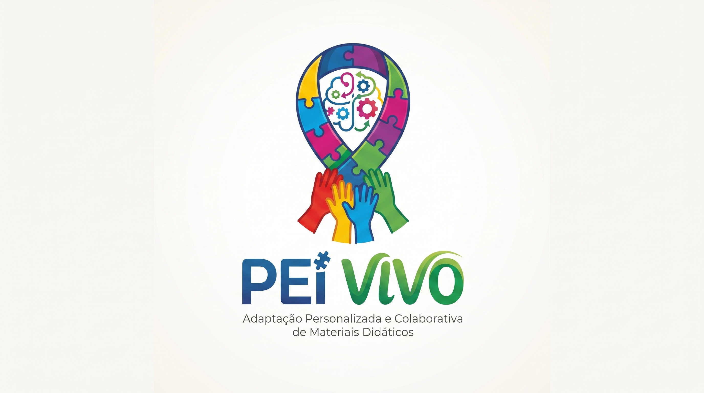
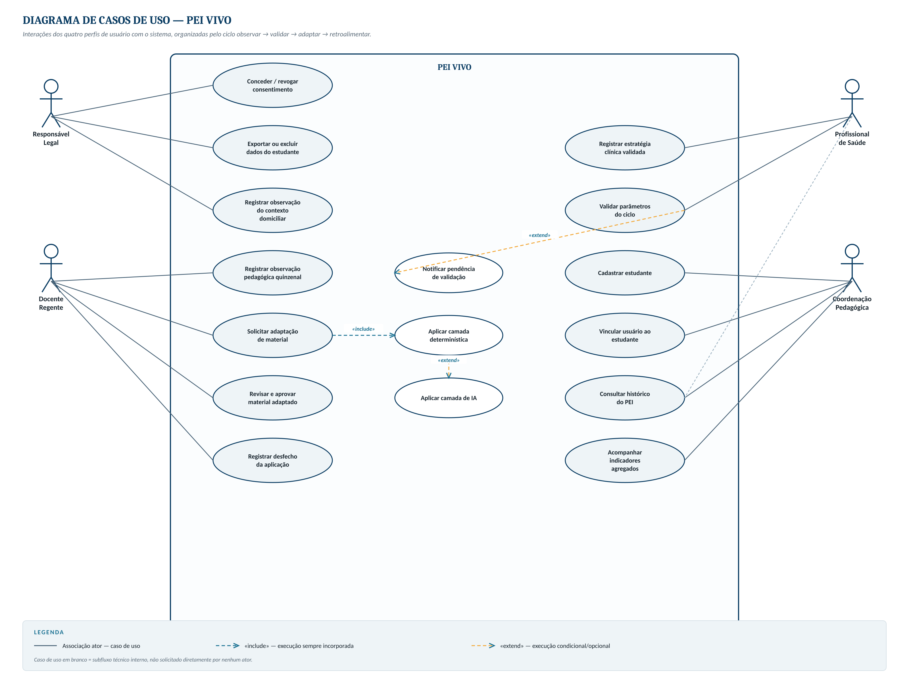
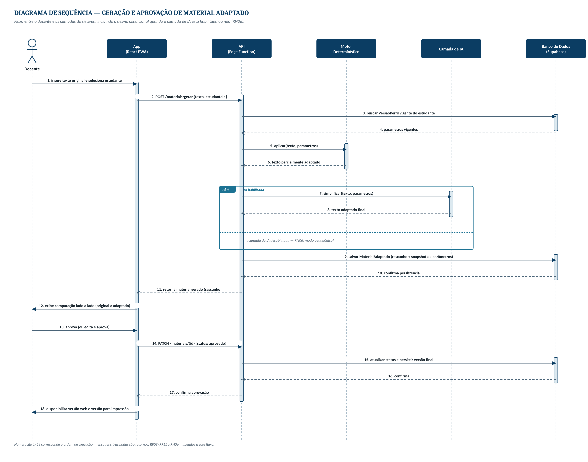
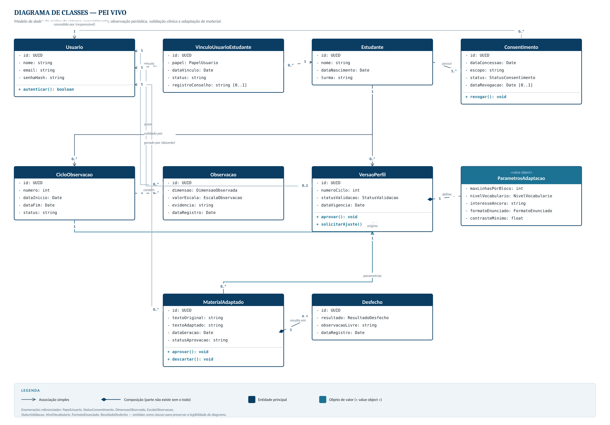
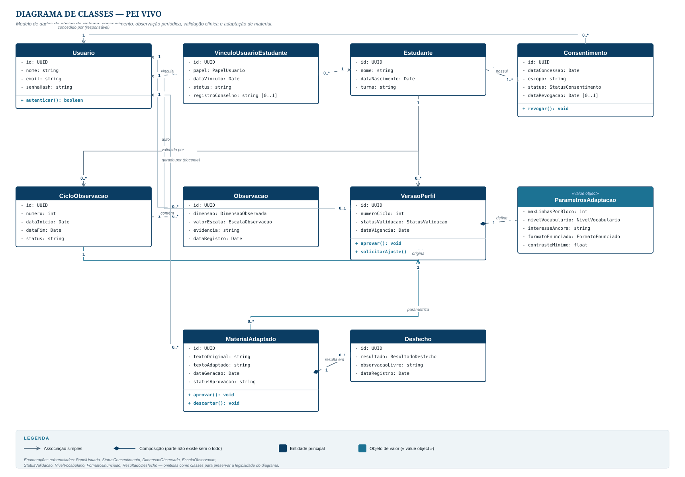
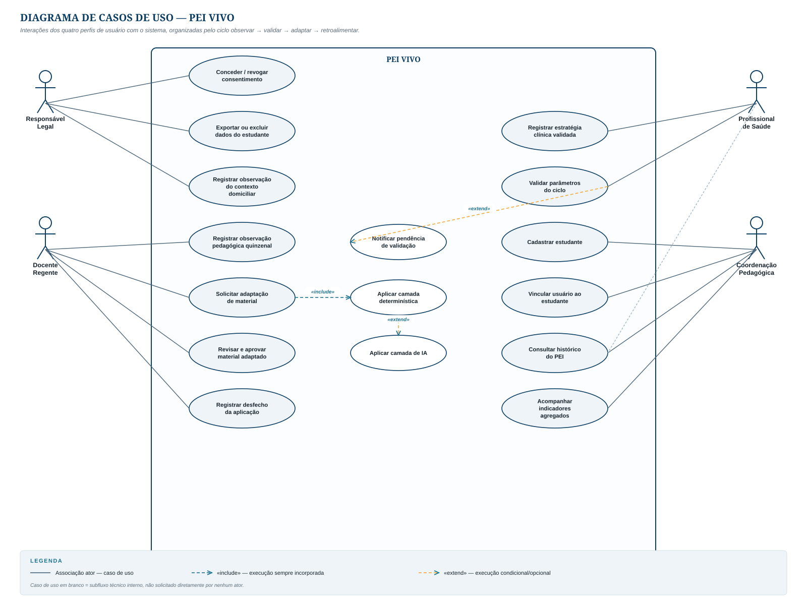
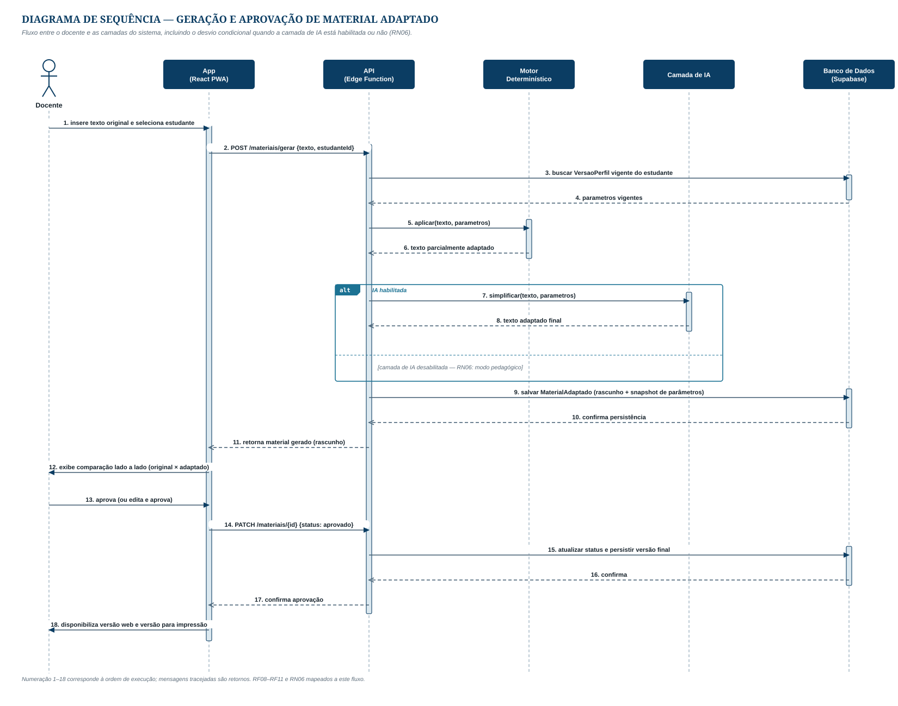

# TCC - Geandre & Jean

## Links: 
[https://docs.google.com/forms/u/1/d/1GVKb3-J0hIfPdHtQQr9dMCaTQ-VTrgexvaHIUSb8ygY/edit](https://docs.google.com/forms/u/1/d/1GVKb3-J0hIfPdHtQQr9dMCaTQ-VTrgexvaHIUSb8ygY/edit)

[https://forms.gle/K5itjuLAjXvxDRy](https://forms.gle/K5itjuLAjXvxDRy)

[https://drive.google.com/drive/folders/1AdHHRxHsGkzGwgievZwpVku8UVT36TNI](https://drive.google.com/drive/folders/1AdHHRxHsGkzGwgievZwpVku8UVT36TNI)

[https://quaint-dish-4a7.notion.site/TRABALHO-DE-CONCLUS-O-DE-CURSO-_-SIS-244af69172ee80dfad5bf89baea4ea41](https://app.notion.com/p/244af69172ee80dfad5bf89baea4ea41?pvs=21)

Slide: [https://www.canva.com/design/DAHTOI1Nx60/9Wj81o5nVsdOHwYq19aLMg/edit?ui=eyJBIjp7fX0](https://canva.link/fhqmraf1uscdjwr)

Dados completos slide: 

[PEI_Vivo_Apresentacao_Dados_Completos](https://app.notion.com/p/PEI_Vivo_Apresentacao_Dados_Completos-3c62895e8dc8801d9eeedd6966febaf4?pvs=21)

# PEI Vivo

> Plataforma colaborativa de acompanhamento e adaptação personalizada de materiais didáticos para estudantes com TEA, TDAH e dislexia.
> 

**Status:** Pré-projeto submetido
**Curso:** Sistemas de Informação — CEUNI FAMETRO
**Período:** 2º semestre / 2026
**ODS:** 4 (Educação de Qualidade) + 3 (Saúde e Bem-estar)

---

## 1. A frase de uma linha

O PEI é um plano obrigatório por lei que hoje vira PDF na gaveta. O PEI Vivo transforma esse plano em algo que **executa a si mesmo**.

---

## 2. O problema

### 2.1 O que está quebrado

| Problema | Consequência prática |
| --- | --- |
| PEI existe por lei mas é documento estático | Feito uma vez por período, arquivado, não muda nada em sala |
| Escola, família e terapeuta não conversam de forma estruturada | Informação vive no WhatsApp, sem histórico nem padronização |
| Conhecimento sobre o aluno se perde na troca de professor | Recomeça a observação do zero todo ano |
| Adaptar material manualmente leva ~40 min por texto | Com 30 alunos na sala, simplesmente não acontece |
| Ferramentas existentes têm "modo dislexia" genérico | Ignora que cada aluno tem um perfil diferente |

### 2.2 Os números que sustentam

- **2,5 milhões** de matrículas na Educação Especial em 2025 (+82% vs. 2021)
- **Mais de 90%** já em classes comuns do ensino regular
- **Apenas 11,3%** das equipes gestoras com formação continuada em Educação Especial

> O acesso avançou. A estrutura pedagógica para sustentá-lo, não.
> 

### 2.3 A base legal

- **Lei 13.146/2015 (LBI)** — garante o PEI
- **Lei 14.254/2021** — obriga a articulação escola ↔ saúde para dislexia e TDAH
- **Lei 13.709/2018 (LGPD)** — dado de criança com deficiência é dado sensível

⭐ **A Lei 14.254/2021 é o argumento mais forte do projeto.** Ela exige a integração entre rede de ensino e rede de saúde — e hoje não existe ferramenta que faça isso. O sistema não é uma ideia solta; é a operacionalização de uma exigência legal sem instrumento.

---

## 3. A ideia central

### 3.1 O ciclo fechado

```
   ┌──────────────────────────────────────────────┐
   │                                              │
   ▼                                              │
REGISTRAR ──► PARAMETRIZAR ──► ADAPTAR ──► RETROALIMENTAR
   │                │              │              │
 3 atores      perfil vira    material p/     resultado
 alimentam     parâmetros     AQUELE aluno    refina perfil
 o perfil      técnicos
```

### 3.2 Por que as duas metades juntas

Separadas, as duas ideias são fracas. Juntas, se sustentam:

- **Só o registro compartilhado** → informação bonita que ninguém usa
- **Só o adaptador de texto** → adaptação genérica, igual pra todo mundo
- **Os dois ligados** → o perfil construído pelos 3 atores é *exatamente* o que parametriza a adaptação, e o resultado da adaptação é *exatamente* o que refina o perfil

### 3.3 O que NÃO é

Vale deixar explícito — isso protege o projeto na banca:

- ❌ Não diagnostica nem sugere hipótese diagnóstica
- ❌ Não substitui o AEE nem a terapia
- ❌ Não avalia desempenho nem atribui nota
- ❌ Não publica material sem revisão humana
- ❌ Não é sincronização offline bidirecional (só cache de leitura + fila de envio)

---

## 4. Os 4 perfis de usuário

| Perfil | O que faz |
| --- | --- |
| **Responsável legal** | Concede/revoga consentimento, registra contexto domiciliar, acompanha resultados |
| **Docente regente** | Registra observações de sala, solicita adaptação, revisa e aprova, registra desfecho |
| **Profissional de apoio** | TO, fono, psicopedagogo ou psicólogo; registra estratégias validadas clinicamente |
| **Coordenação pedagógica** | Cadastra aluno, vincula usuários, acompanha indicadores, consolida histórico do PEI |

---

## 5. Exemplo real de uso

### Os personagens

- **Miguel**, 9 anos, 4º ano, TEA nível 1 com dificuldade de leitura
- **Márcia**, professora regente, 31 alunos, 3 com laudo
- **Dona Rosa**, mãe, trabalha o dia todo
- **Camila**, terapeuta ocupacional, atende 2x por semana

Hoje esses quatro **não conversam**.

---

### Semana 0 — Consentimento

A coordenadora cadastra o Miguel e envia convite para o celular da Dona Rosa. Ela lê em linguagem simples: quais dados serão coletados, quem vê o quê, por quanto tempo. Autoriza.

**Sem esse aceite, nenhum perfil é criado.** E ela pode revogar quando quiser.

---

### Semana 1 — Montando o perfil

Cada um registra o que só ele sabe:

| Quem | Registra |
| --- | --- |
| **Camila** (terapeuta) | Instrução com +2 etapas trava · Antecipar mudanças reduz crise |
| **Márcia** (professora) | Perde o fio em texto >5 linhas · Levanta da cadeira após ~12 min |
| **Dona Rosa** (mãe) | Ruído alto é gatilho · Responde a elogio imediato · Ama dinossauros |

O sistema consolida isso em um **Perfil de Aprendizagem** — que não é diagnóstico, é um conjunto de parâmetros operacionais:

```json
{
  "maxLinhasPorBloco": 4,
  "nivelVocabulario": "basico",
  "interesseAncora": "dinossauros",
  "formatoEnunciado": "etapa_unica",
  "contrasteMinimo": 7
}
```

> Não descrevemos o transtorno do Miguel. Descrevemos **o que funciona com o Miguel**.
> 

---

### Semana 2, domingo 21h — O momento em que o projeto acontece ⭐

Márcia precisa preparar a aula de Ciências sobre o ciclo da água. Abre o sistema **no celular**, cola o texto e toca em *adaptar para o Miguel*.

Em ~40 segundos ela recebe:

- Tipografia e espaçamento ajustados
- Parágrafos quebrados em blocos de até 4 linhas
- Palavras difíceis marcadas, com explicação ao toque
- O exemplo do ciclo da água **reescrito com dinossauros no cenário**
- Comandos reescritos em etapa única
- Duas saídas: versão web acessível + versão para imprimir

Ela **revisa** (o sistema nunca publica sozinho), aprova, pronto.

**Antes:** 40 minutos. Ou, na maioria das vezes, não acontecia.

---

### Semana 2, terça — O retorno

Miguel leu o texto inteiro sozinho, pela primeira vez.

Márcia toca em 👍 e escreve: *"Terminou sozinho. A âncora de interesse funcionou."*

---

### Semana 3 — O loop fecha

- **Dona Rosa** vê em casa o que deu certo e reforça
- **Camila** vê resultado real em sala, não só relato
- **O sistema** registra: material com âncora de interesse → 80% de conclusão vs. 30% sem
- **O perfil se atualiza**, e a próxima adaptação já sai melhor

Na reunião de PEI do bimestre, a coordenação não abre documento em branco. Abre **histórico com evidência**.

---

## 6. Matriz de permissões

O controle é orientado por **necessidade operacional, não por hierarquia**.

| Informação | Responsável | Docente | Prof. de apoio | Coordenação |
| --- | --- | --- | --- | --- |
| Diagnóstico e laudo clínico | Total | ❌ | Total | Resumo |
| Gatilhos e estratégias | Leitura + escrita | Leitura + escrita | Leitura + escrita | Leitura |
| Registros de sala | Leitura | Leitura + escrita | Leitura | Leitura |
| Registros do contexto familiar | Leitura + escrita | Leitura | Leitura | Leitura |
| Nota clínica reservada | ❌ | ❌ | Leitura + escrita | ❌ |
| Gerar material adaptado | ❌ | ✅ | ✅ | ✅ |
| Conceder/revogar consentimento | Exclusivo | ❌ | ❌ | ❌ |

💡 **A decisão de design mais importante:** o professor **não** acessa o laudo. Ele precisa saber que instrução longa trava — não precisa saber o CID. Menos dado circulando = menos risco de rotulação + conformidade com o princípio de minimização de dados da LGPD.

---

## 7. Modelo de dados

```
Estudante
 ├─ Consentimento (responsável, escopo, data, status de revogação)
 ├─ PerfilDeAprendizagem
 │    ├─ Gatilho        (o que desorganiza)
 │    ├─ Estrategia     (o que funciona)
 │    ├─ Interesse      (âncora de engajamento)
 │    └─ ParametroAdaptacao  ← vira config do motor
 ├─ Registro (observação datada, autor, nível de visibilidade)
 └─ MaterialAdaptado
      ├─ texto_original
      ├─ texto_adaptado
      ├─ parametros_snapshot   ⭐ crítico
      └─ Retorno (desfecho + observação livre)
```

⚠️ **`parametros_snapshot` é o campo mais importante do sistema.** Ele guarda *qual versão do perfil* gerou aquele material. Sem ele, é impossível correlacionar depois o que funcionou com qual configuração — e o ciclo de retroalimentação deixa de existir.

---

## 8. Motor de adaptação — as duas camadas

### Camada 1 — Determinística (o núcleo)

Regras explícitas em TypeScript, roda no cliente:

- Família tipográfica e corpo de fonte
- Espaçamento entre caracteres, palavras e linhas
- Razão de contraste
- Segmentação em blocos conforme limite do perfil
- Reconstrução de enunciados compostos em etapa única

✅ Não depende de serviço externo
✅ Mesma entrada → mesma saída, sempre
✅ Funciona com a IA desligada

### Camada 2 — Assistida por IA (opcional)

Modelo de linguagem, roda no servidor:

- Simplificação lexical (com termo original em glossário consultável)
- Recontextualização de exemplos pelo interesse âncora
- Preserva integralmente o conteúdo conceitual

⚠️ Revisão humana obrigatória antes de publicar
⚠️ Pode ser desativada sem quebrar o sistema

---

## 9. Stack técnica

### 9.1 Visão geral

| Camada | Escolha | Por quê |
| --- | --- | --- |
| Linguagem | **TypeScript** | Tipa perfil e permissões; compilador impede parâmetro inválido |
| Front | **React + Vite + PWA** | Leve, mobile-first; sem SSR/SEO, Next.js seria peso morto |
| Estilo | **Tailwind CSS** | Responsivo rápido |
| Estado servidor | **TanStack Query** | Cache e revalidação prontos; evita Redux desnecessário |
| Validação | **Zod** | Valida parâmetros do perfil e a saída da IA |
| Banco + Auth | **Supabase (PostgreSQL + RLS)** | Permissão no nível do dado, não da interface |
| Servidor | **Supabase Edge Functions** | Esconde a chave da IA |
| IA | **API de LLM atrás de interface própria** | Trocar provedor sem reescrever |
| Versão impressa | **CSS `@media print`** | Dispensa biblioteca de PDF |
| Testes | **Vitest** + **Playwright** | Unitário + ponta a ponta |
| Acessibilidade | **axe-core** + **NVDA** | Automatizado + manual |
| Deploy | **Vercel/Netlify** + Supabase Cloud | Gratuito |
| Apoio | **Git/GitHub**, **Figma** | Versionamento e protótipo |

### 9.2 Por que Supabase E Edge Functions (não é escolha)

A chave da API de IA **não pode ficar no frontend** — qualquer pessoa abre o DevTools e usa a conta. Então precisa de código no servidor de qualquer forma.

```
React/Vite  ──►  Edge Function  ──►  API de LLM
    │              (guarda a chave)
    │
    └────────►  Supabase (Postgres + RLS + Auth)
```

### 9.3 Tipos-chave

```tsx
type PerfilAdaptacao = {
  maxLinhasPorBloco: number;
  nivelVocabulario: 'basico' | 'intermediario' | 'original';
  interesseAncora: string | null;
  formatoEnunciado: 'etapa_unica' | 'multiplas_etapas';
  contrasteMinimo: 4.5 | 7;
};

type Papel = 'familia' | 'professor' | 'terapeuta' | 'coordenacao';
```

### 9.4 O que ficou de fora de propósito

- ❌ Next.js — sem SEO nem SSR, só adicionaria complexidade
- ❌ Redux — TanStack Query resolve
- ❌ Biblioteca de geração de PDF — print CSS basta
- ❌ ORM pesado — cliente do Supabase resolve
- ❌ App nativo — PWA cobre o caso de uso
- ❌ Sync offline bidirecional — é um TCC inteiro sozinho

---

## 10. Riscos de execução

| Risco | Mitigação |
| --- | --- |
| Projeto Supabase gratuito **pausa por inatividade** | Script de seed + testar ambiente 48h antes da defesa |
| Custo por chamada de IA | Limite por usuário + cache (texto igual + perfil igual = não regera) |
| API externa cair na apresentação | Material já adaptado salvo no banco + modo demo com IA desligada |
| Escopo do offline estourar o prazo | Só cache de leitura + fila de envio; sem merge de conflito |
| Não conseguir escola parceira | Validar com docentes individuais; não depende de convênio institucional |

---

## 11. Resultados esperados

### 11.1 Qualitativos

- PEI convertido de documento estático em plano operacional
- Comunicação estruturada, datada e recuperável entre os 3 atores
- Redução da sobrecarga docente percebida
- Validação do modelo de permissões junto aos profissionais
- Confiança no conteúdo gerado (via revisão obrigatória)
- Confirmação de que mobile-first corresponde ao uso real

### 11.2 Quantitativos

| Indicador | Instrumento | Meta |
| --- | --- | --- |
| Tempo de adaptação | Cronometragem comparativa | Redução ≥ 80% |
| Usabilidade | Escala SUS com docentes | ≥ 68 pontos |
| Legibilidade | Índice Flesch (PT-BR), antes/depois | Ganho ≥ 15 pontos |
| Acessibilidade | axe-core + leitor de tela | Zero violação A e AA |
| Controle de acesso | Testes de acesso indevido | 100% bloqueadas |
| Conclusão de leitura | Registro de desfecho pelo docente | Superior ao não adaptado |
| Materiais por docente | Contagem no sistema | ≥ 5 por participante |
| Tempo de geração | Instrumentação em rede móvel | < 60 segundos |
| Cobertura de testes | Relatório Vitest | ≥ 70% |

⚠️ **Meta quantitativa vira compromisso.** A banca vai cobrar na apresentação final. Revisar se algum valor é arriscado para o prazo.

---

## 12. Cronograma

| Etapa | Previsão |
| --- | --- |
| Levantamento bibliográfico | Ago–Set / 2026 |
| Defesa e aprovação do tema | Set / 2026 |
| Requisitos e arquitetura | Set–Out / 2026 |
| Protótipo de interface | Out / 2026 |
| Desenvolvimento e testes | Out–Nov / 2026 |
| Escrita da monografia | Ago–Nov / 2026 |
| Defesa e demonstração | Dez / 2026 |

**Ordem inegociável:** núcleo de dados e permissões **antes** do motor de adaptação. Se a base falhar, o resto não existe.

**Cortar se apertar:** relatórios da coordenação, notificações, app nativo, sugestão automática de intervenção.
**Nunca cortar:** consentimento, permissões, vínculo perfil → material.

---

## 13. Defesa — perguntas e respostas

**"Isso não é só um wrapper de ChatGPT?"**
Não. A IA é camada opcional que atua só em vocabulário e contextualização. O núcleo é o modelo de dados, o controle de acesso e o ciclo de retroalimentação. O motor determinístico roda sem IA — posso demonstrar com ela desligada.

**"E se a IA distorcer o conteúdo?"**
Nada é publicado automaticamente. O professor revisa com o texto original lado a lado. Ele é a autoridade pedagógica; o sistema é ferramenta.

**"Privacidade de dados de criança com deficiência?"**
Consentimento explícito e revogável, permissões aplicadas no próprio banco via RLS, minimização de dados por design, auditoria de acessos.

**"Já não existe isso?"**
Existem sistemas de comunicação escola-família. Existem adaptadores de texto. Existem gestores de PEI. **Não existe a integração.** Inovação combinatória — por isso avaliamos como 4, não 5.

**"Usar Supabase não é só configurar um produto?"**
As políticas RLS são código SQL que escrevo, versiono e testo. Levo a matriz de permissões e os testes provando que o professor não lê o laudo nem por chamada direta à API.

**"O professor vai mesmo usar?"**
É por isso que é mobile-first e PWA. Ele planeja aula em casa, à noite, no celular. Ferramenta que só roda no computador da escola não é usada. Validamos com SUS junto a docentes reais.

---

## 14. Como apresentar

### Pitch de 30 segundos

> A lei brasileira garante que todo aluno com autismo, TDAH ou dislexia tenha um Plano Educacional Individualizado. Na prática, esse plano vira um PDF arquivado e não muda nada do material que o aluno recebe. Nosso sistema conecta as três pessoas que conhecem esse aluno — professor, família e terapeuta — em um perfil compartilhado, e usa esse perfil para adaptar automaticamente o material didático. O professor cola o texto e recebe a versão que funciona **para aquele aluno**. Depois marca se funcionou, e o sistema aprende. O plano deixa de ser papel e passa a executar a si mesmo.
> 

### Dois erros que derrubam a explicação

1. ❌ **Dizer que o sistema "identifica" ou "avalia" o aluno.** Ele não diagnostica. Registra observações de quem convive e converte em parâmetros de formatação. Se a banca entender que vocês classificam crianças automaticamente, a discussão ética inteira é perdida.
2. ❌ **Abrir pela tecnologia.** Se começar com "usamos React, Supabase e RLS", a banca ouve mais um CRUD. **Abra pelo Miguel.** A stack entra depois, como consequência do problema.

---

## 15. Referências

Todas verificadas. Dez na janela 2021–2026, mais três dispositivos legais de base.

1. ABNT. **NBR 17060**: acessibilidade em aplicativos de dispositivos móveis – requisitos. Rio de Janeiro, 2022.
2. ABNT. **NBR 17225**: acessibilidade em conteúdo e aplicações web – requisitos. Rio de Janeiro, 2025.
3. BATTISTELLO, V. C. M.; LISBOA, E. R.; MARTINS, R. L. Inclusão de alunos com autismo em sala de aula e o Plano Educacional Individualizado (PEI). **Linguagens, Educação e Sociedade**, v. 28, n. 57, p. 1-23, 2024. DOI: 10.26694/rles.v28i57.4334
4. BRASIL. **Lei nº 13.146**, de 6 de julho de 2015 (LBI).
5. BRASIL. **Lei nº 13.709**, de 14 de agosto de 2018 (LGPD).
6. BRASIL. **Lei nº 14.254**, de 30 de novembro de 2021.
7. CAST. **Universal Design for Learning Guidelines version 3.0**. Lynnfield, 2024.
8. FONTANA, E. C.; CRUZ, G. C. Plano Educacional Individualizado e o reconhecimento da diferença para o ensino da Educação Física. **Caderno de Educação Física e Esporte**, v. 20, 2022. DOI: 10.36453/cefe.2022.29468
9. INEP. **Notas estatísticas: Censo Escolar da Educação Básica 2025**. Brasília, 2026.
10. INSTITUTO RODRIGO MENDES. **Panorama da Educação Especial 2025**. São Paulo, 2025.
11. MODESTO, M. A.; ARAÚJO, I. R. L.; MENDONÇA, A. C. S. Desafios e possibilidades para a implementação de uma educação especial e inclusiva na rede estadual de ensino de Sergipe. **Revista Brasileira de Educação Especial**, v. 29, 2023. DOI: 10.1590/1980-54702023v29e0234
12. PEREIRA, M. A. M. Planejamento educacional individualizado: desafios e avanços nas práticas colaborativas de ensino. **Colloquium Humanarum**, v. 19, n. 1, 2022.
13. SILVA, G. L.; CAMARGO, S. P. H. Revisão integrativa da produção científica nacional sobre o Plano Educacional Individualizado. **Revista Educação Especial**, Santa Maria, v. 34, p. 1-23, 2021. DOI: 10.5902/1984686X66509
14. W3C. **Web Content Accessibility Guidelines (WCAG) 2.2**. W3C Recommendation, 5 out. 2023 (atualizada 12 dez. 2024).

---

LOGO - Projeto 

Slide 1 - tema e nome da dupla

Slide 2 - Sistemas semelhantes 3 e o diferencial do nosso

Slide 3 - Metodologia Ágil (Kanbam)

Slide 4 - Requisitos Funcionais e Não funcionais

Slide 5 - Regra de negócio 

Slide 6 - Rastreabilidade 2 ou 3

Slide 7 - ISO25010 

[https://quaint-dish-4a7.notion.site/TRABALHO-DE-CONCLUS-O-DE-CURSO-_-SIS-244af69172ee80dfad5bf89baea4ea41](https://app.notion.com/p/244af69172ee80dfad5bf89baea4ea41?pvs=21)




Rastreabilidade - Sem ocorrer uma mudança no código pedir para a IA analisar os impactos que isso irá causar dentro da estrutura do sistema



### As 5 perguntas de validação

### Bloco 0 — Perfil (não conta nas 5)

1. Qual seu vínculo com o tema? *(Professor(a) / Pai, mãe ou responsável de criança com TEA, TDAH ou dislexia / Profissional de saúde ou educação / Sem vínculo direto / Outro)*

### As 5 perguntas

**Q1 — Percepção do problema** *(Escala 1-5, discordo → concordo totalmente)*

A comunicação entre escola, família e profissionais de saúde sobre uma criança com TEA, TDAH ou dislexia hoje costuma ser informal e fragmentada.

**Q2 — Reação ao conceito** *(Escala 1-5)*

O quanto essa proposta parece resolver o problema descrito acima?

**Q3 — Preocupações** *(Múltipla escolha, pode marcar mais de uma)*

Quais preocupações você teria com um sistema assim? *(Privacidade dos dados da criança / Confiabilidade do material gerado por IA / Tempo extra exigido do professor / Dependência de tecnologia em escolas com poucos recursos / Nenhuma preocupação)*

**Q4 — Intenção de adoção** *(Escala 1-5)*

Se essa plataforma existisse hoje, o quanto uma escola que você conhece se beneficiaria dela?

**Q5 — Fechamento qualitativo** *(Aberta)*

Existe algo nessa proposta que te preocupa, ou algo que você acrescentaria pensando em quem realmente vai usá-la?

////

Mapeamento pro Slide 

[PEI_Vivo_Slides_Mapeamento.md](PEI_Vivo_Slides_Mapeamento.md)

[PEI_Vivo_Slides_Mapeamento](https://app.notion.com/p/PEI_Vivo_Slides_Mapeamento-3c52895e8dc880b38235c18cb6119e31?pvs=21)

////











