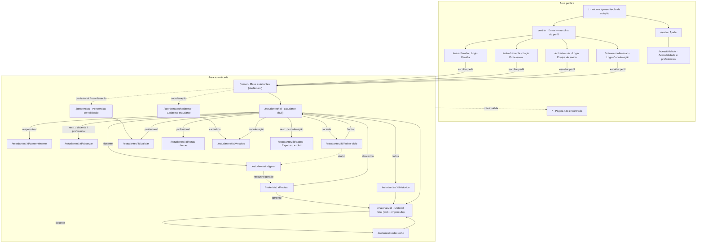

# PEI Vivo — UX/UI, arquitetura da informação e design system

**Versão:** 1.0 — 14/09/2026
**Etapa da orientação:** 4 (Design UX/UI) e 5 (protótipo front-end).
**Implementação:** `apps/web/src/styles/tokens.css` (tokens), `componentes.css` (componentes e estados), `routes/index.tsx` (mapa de telas).

## 0. Perguntas de UX (orientação, etapa 4)

| Pergunta | Resposta de projeto |
|---|---|
| Quem é o usuário? | Quatro perfis; o decisivo é a docente Márcia (`docs/validacao-da-ideia.md` §2) |
| Que problema precisa resolver? | Ter, em poucos toques e no celular, o material que funciona para aquele aluno — com respaldo da família e da equipe de saúde |
| Que dificuldades pode encontrar? | Pouco tempo, tela pequena, brilho baixo à noite, medo de rotular o aluno, desconfiança da IA, termos jurídicos |
| Como tornar a navegação simples? | Um layout; painel leva direto à ação do papel; ≤ 4 telas por tarefa; "Voltar para …" sempre visível; sem submenus |
| Que emoções queremos? | Alívio ("cabe no meu domingo"), confiança ("eu reviso, eu aprovo"), respeito ("meu filho não é um CID") |

---

## 1. Arquitetura da informação

### 1.1 Princípios

1. **Um layout, quatro papéis.** Não existe "modo admin": a navegação é a mesma; o que muda é o conteúdo do painel e as ações da tela do estudante.
2. **O estudante é o eixo.** Toda tela operacional está sob `/estudantes/:id/...` ou `/materiais/:id/...`; a tela do estudante é o hub.
3. **A permissão decide a rota, não a tela.** Rotas existem para todos; a camada de serviços nega e a tela mostra o motivo (D-17).
4. **Estados são rotas de primeira classe.** Carregando, vazio, erro e negado têm layout próprio em cada tela.

### 1.2 Fluxo de navegação

Fluxo do caso central (docente, domingo 21h): **Entrar → Professores → Painel → (Gerar material) → Revisar → Aprovar → Material** — cinco telas, quatro toques além de colar o texto (o segundo toque do login some com o Supabase Auth, que lembra a sessão).

### 1.3 Mapa de conteúdo por papel

| Tela | Responsável | Docente | Profissional | Coordenação |
|---|---|---|---|---|
| Painel | lista + "Ver consentimento" | lista + "Gerar material" | lista + "Validar parâmetros" | lista + "Ver histórico" + "Cadastrar" |
| Estudante (hub) | consentimento, observar, dados, histórico | gerar, observar, fechar ciclo, histórico | validar, observar, notas, histórico | histórico, vínculos, exportar |
| Perfil vigente e materiais | só aprovados | todos (inclusive rascunhos) | só aprovados | só aprovados |

---

## 2. Documento de telas

| Tela | Objetivo | Componentes | Ações do usuário | Estados | Requisitos de acessibilidade |
|---|---|---|---|---|---|
| **Início** (`/`) | Apresentar o problema, a solução em 4 passos e para quem é | Hero, lista numerada `.ciclo`, 3 cards, lista "o que não faz" | Entrar na demonstração; Como funciona | — | h1 único; `section` com `aria-labelledby`; lista ordenada real |
| **Entrar** (`/entrar`) | Porta de entrada: escolher o tipo de perfil (D-16) | Logo, lista `.perfis` de 4 links (Família, Professores, Equipe de saúde, Coordenação) | Ir para a tela de login do perfil | — | `ul aria-label="Perfis de acesso"`; links com nome + público |
| **Login por perfil** (`/entrar/familia`, `/docente`, `/saude`, `/coordenacao`) | Especificação do papel + entrada | Voltar, h1 com glifo, 2 cards (o que faz; o que vê / nunca vê), grupo de `<button>` de demonstração, card "como será o acesso real" | Escolher perfil de demonstração → painel (ou rota de origem); escolher outro perfil | carregando · erro · slug inválido (404) | h1 → h2 sem salto; `role=group` nomeado; sem senha (3.3.8); descrição por perfil diz o que ele demonstra |
| **Ajuda** (`/ajuda`) | Documentação e ferramentas de demo | Cards com `dl`/`ol`; 2 botões | Restaurar dados; simular falha | — | `aria-pressed` no toggle; anúncios live |
| **Acessibilidade** (`/acessibilidade`) | Preferências + declaração + atalhos | 3 `fieldset` de rádios, botão, cards, `dl` | Alterar contraste/fonte/movimento; restaurar | — | Preferências aplicam em `<html>`; rádios nativos |
| **Página não encontrada** (`*`) | Recuperar de URL inválida | Estado vazio + 2 links | Ir para início/painel; ajuda | — | h1 "Página não encontrada"; `code` com a rota |
| **Meus estudantes** (`/painel`) | Dashboard: o que posso fazer por cada estudante | Lista `.lista-simples`, badges, `LinkBotao` | Abrir estudante; ação principal do papel; cadastrar (coord.) | carregando · vazio (sem vínculo) · erro · sucesso | `ul aria-label="Estudantes"`; h2 por estudante; badge textual de consentimento |
| **Estudante** (`/estudantes/:id`) | Hub: contexto, ações por papel, perfil vigente, materiais | `CabecalhoEstudante`, alerta de consentimento, grade de cards de ação, `ParametrosLista` (`dl`), lista de materiais | Navegar para cada ação | carregando · negado · sem consentimento · sem perfil · sem materiais · sucesso | Alerta de bloqueio explica RN01/RN08; laudo oculto ao docente (D-01) |
| **Consentimento** (`/estudantes/:id/consentimento`) | Ler termo simples, autorizar, revogar, ver auditoria | Card do termo, badges, checkboxes de escopo, checkbox "li", botão único, modal de revogação, linha do tempo | Autorizar; revogar (dupla confirmação) | somente leitura (outros papéis) · ativo · revogado · erro de validação | `fieldset` escopos; resumo de erros; modal `<dialog>`; `time datetime` |
| **Registrar observação** (`/estudantes/:id/observar`) | 6 dimensões, escala 3 pontos, evidência | 6 cards com `Escala3` + `Campo` área; lista "já registrado" | Escolher escala; escrever; registrar; abrir ciclo (docente) | sem ciclo aberto (vazio + ação) · bloqueado · erro · sucesso | `fieldset/legend` por dimensão; pergunta-guia via `aria-describedby`; validação com resumo |
| **Fechar ciclo** (`/estudantes/:id/fechar-ciclo`) | Ver proposta (diff) e confirmar | Lista de observações, `TabelaDiff`, badge RN06, modal | Fechar; voltar | sem ciclo · sem observações (botão desabilitado) · resultado (sucesso) | Tabela com `caption`/`scope`; "aguardando 2º ciclo" em texto |
| **Validar parâmetros** (`/estudantes/:id/validar`) | Aprovar ou pedir ajuste do conjunto | Card com diff, lista de observações de origem, form com área de justificativa, histórico de versões | Aprovar; solicitar ajuste (com texto) | nada pendente (vazio) · expirada (alerta) · em revisão · erro | Nunca mostra material (RN07); campo obrigatório condicional com erro associado |
| **Notas clínicas** (`/estudantes/:id/notas-clinicas`) | Escrever/ler notas reservadas | Alerta de escopo, form, cards | Registrar nota; ir para observação | negado (RN02) · vazio · sucesso | Alerta "Acesso negado (RN02)" como `role=alert` com link de saída |
| **Gerar material** (`/estudantes/:id/gerar`) | Colar texto e gerar rascunho | Alerta com perfil vigente, `Campo` título, área de texto com contador, botão, atalho de exemplo, progresso | Colar; gerar; usar exemplo | sem perfil vigente (vazio + ação) · bloqueado · validando · gerando (progresso) · erro | Contador `aria-live`; resumo de erros; `aria-busy` |
| **Revisar** (`/materiais/:id/revisar`) | Original × adaptado; editar; aprovar/descartar | Badges (rascunho, tempo, IA), alerta IA, `.comparacao` (2 `section` nomeadas), `MaterialAdaptado` ou área editável, botões, modal | Alternar edição; aprovar; descartar; decidir depois | já revisado · erro | Empilha < 768 px; `aria-pressed` no editar; modal de descarte |
| **Material** (`/materiais/:id`) | Versão web acessível + impressão + desfecho | `MaterialAdaptado`, badges, `details` com original, botão imprimir, card de desfecho | Imprimir; registrar desfecho; ver original | rascunho (alerta) · aprovado · com desfecho · não encontrado | `article lang`; `data-contraste`; `print.css` esconde cabeçalho/rodapé/botões |
| **Desfecho** (`/materiais/:id/desfecho`) | 3 opções + texto, 2 toques | `fieldset` com 3 rádios em cartão, `Campo` área, botões | Escolher; escrever; registrar | erro de validação · sucesso | Grupo nomeado; erro ligado ao grupo |
| **Histórico** (`/estudantes/:id/historico`) | Linha do tempo do PEI | Card por ciclo (observações, versão, materiais + desfecho), linha do tempo de auditoria | Abrir material; exportar | sem ciclos (vazio) · negado (D-11) · sucesso | h2 por ciclo, h3 por seção; `ol.linha-tempo` com `time` |
| **Pendências** (`/pendencias`) | Fila de validação (D-07) | Tabela | Abrir validação; abrir estudante | vazio · sucesso | `caption` com contagem; `th scope=row` |
| **Cadastrar estudante** (`/coordenacao/cadastrar`) | RPC atômica (D-08) | 4 `Campo` (2 `type=date`), botões | Cadastrar → vínculos | negado (não coordenação) · erro de validação | Datas com `max`; dica de formato; resumo de erros |
| **Vínculos** (`/estudantes/:id/vinculos`) | Criar/desativar vínculos (D-13, D-14) | Lista de ativos com botão, form (select + rádios + campo condicional), card de inativos, modal | Vincular; desativar | negado · vazio · erro | Campo de registro só aparece para profissional e é obrigatório |
| **Dados do estudante** (`/estudantes/:id/dados`) | Exportar / excluir (RF15) | 2 cards, `details` com JSON, modal com campo de confirmação | Exportar; excluir (nome exato) | negado · exportado · erro | `pre tabIndex=0` rolável; anúncio assertivo após exclusão |

---

## 3. Design system

### 3.1 Paleta (HEX)

| Token | HEX | Uso |
|---|---|---|
| `--cor-primaria` | `#1D4E89` | Botões primários, links, foco, marca |
| `--cor-primaria-escura` | `#163B68` | Hover/active do primário |
| `--cor-primaria-tint` | `#E8EFF8` | Fundos suaves (info, seleção, hero) |
| `--cor-secundaria` | `#0F6E56` | Reservada (destaques da marca) |
| `--cor-texto` | `#1B1B1B` | Texto principal |
| `--cor-texto-secundario` | `#4D4D4D` | Metadados, dicas |
| `--cor-fundo` | `#F6F8FB` | Fundo da página |
| `--cor-superficie` | `#FFFFFF` | Cards, campos, cabeçalho |
| `--cor-superficie-2` | `#EDEFF2` | Cabeçalho de tabela, badge neutro, `pre` |
| `--cor-borda` | `#767676` | Bordas de campos (informativas) |
| `--cor-borda-suave` | `#D5D9E0` | Bordas decorativas de cards |
| `--cor-sucesso` / `-fundo` | `#1E6B3A` / `#E3F3E8` | Aprovado, ativo, vigente |
| `--cor-aviso` / `-fundo` | `#8A5300` / `#FFF3D6` | Rascunho, pendente, atenção |
| `--cor-erro` / `-fundo` | `#B42318` / `#FDE8E6` | Erro, negado, revogado, perigo |
| `--cor-info` / `-fundo` | `#1D4E89` / `#E8EFF8` | Informação |
| `--material-fundo` / `-texto` | `#FFFDF5` / `#1B1B1B` | Material adaptado (contraste 4,5); com `contrasteMinimo = 7` → `#FFFFFF` / `#000000` |

**Alto contraste** (`data-contraste="alto"`): primária `#0B2A50`, texto `#000000`, secundário `#333333`, sucesso `#0F4A24`, aviso `#5C3600`, erro `#8B1A10`, todas as bordas `#000000`, fundos coloridos → `#FFFFFF`.

### 3.2 Combinações verificadas (WCAG 1.4.3 / 1.4.11)

Calculadas pela fórmula de luminância relativa da WCAG (script em `scripts/contraste.mjs`).

| Combinação | Razão | Exigido | Uso |
|---|---|---|---|
| `#1B1B1B` sobre `#FFFFFF` | 17,22:1 | 4,5 | texto em cards |
| `#1B1B1B` sobre `#F6F8FB` | 16,19:1 | 4,5 | texto na página |
| `#4D4D4D` sobre `#FFFFFF` | 8,45:1 | 4,5 | metadados |
| `#4D4D4D` sobre `#F6F8FB` | 7,95:1 | 4,5 | metadados na página |
| `#FFFFFF` sobre `#1D4E89` | 8,39:1 | 4,5 | botão primário, item de menu ativo |
| `#1D4E89` sobre `#FFFFFF` | 8,39:1 | 4,5 | links, botão secundário |
| `#1D4E89` sobre `#E8EFF8` | 7,24:1 | 4,5 | texto em fundo info/seleção |
| `#1E6B3A` sobre `#E3F3E8` | 5,67:1 | 4,5 | badge/alerta sucesso |
| `#8A5300` sobre `#FFF3D6` | 5,74:1 | 4,5 | badge/alerta aviso |
| `#B42318` sobre `#FDE8E6` | 5,59:1 | 4,5 | badge/alerta erro |
| `#B42318` sobre `#FFFFFF` | 6,57:1 | 4,5 | erro de campo |
| `#FFFFFF` sobre `#B42318` | 6,57:1 | 4,5 | botão perigo |
| `#4D4D4D` sobre `#EDEFF2` | 7,34:1 | 4,5 | badge neutro |
| `#1B1B1B` sobre `#FFFDF5` | 16,91:1 | 7 (adotado) | material adaptado |
| `#767676` sobre `#FFFFFF` | 4,54:1 | 3 | borda de campo |
| `#1D4E89` (anel de foco) sobre `#F6F8FB` | 7,89:1 | 3 | foco |
| Alto contraste: `#000000` sobre `#FFFFFF` | 21:1 | 7 | texto |
| Alto contraste: `#FFFFFF` sobre `#0B2A50` | 14,37:1 | 7 | botão primário |
| Alto contraste: `#8B1A10` sobre `#FFFFFF` | 9,32:1 | 7 | erro |
| Alto contraste: `#5C3600` sobre `#FFFFFF` | 10,59:1 | 7 | aviso |

`#D5D9E0` (1,42:1) é usada **somente** em bordas decorativas de cards, que não transmitem informação — permitido pela 1.4.11. Estados desabilitados (`#6B6B6B` sobre `#E9E9E9`, 4,39:1) estão isentos pela WCAG, mas ficam perto do mínimo por escolha.

### 3.3 Tipografia

| Token | Valor | Uso |
|---|---|---|
| `--fonte-base` | `system-ui, -apple-system, "Segoe UI", Roboto, …` | Interface (sem web font: offline e desempenho) |
| `--fonte-leitura` | `"Atkinson Hyperlegible", Verdana, system-ui` | Material adaptado (Atkinson se instalada; Verdana como fallback legível) |
| Escala | 14 (xs, só metadados) · **16 (sm, corpo)** · 18 (md) · 22 (lg) · 28 (xl) · 36 (2xl) | `h1` = xl, `h2` = lg, `h3` = md |
| Altura de linha | 1,6 (interface) · 1,9 (material) · 1,25 (títulos) | |
| Pesos | 400 · 500 · 700 | |
| Preferências | 118,75 % (19 px) · 137,5 % (22 px) via `data-fonte` | Tela Acessibilidade |

### 3.4 Espaçamento, grid e breakpoints

- Base **4 px**: `--esp-1` 4 · `2` 8 · `3` 12 · `4` 16 · `5` 24 · `6` 32 · `7` 48 · `8` 64.
- Contêiner `max-width: 64rem` (1024 px), gutter 16 px; largura de leitura `44rem` (704 px).
- Grid por CSS Grid: 1 coluna (< 768 px) → 2 colunas (≥ 48em) → 3 colunas (≥ 64em, `.grade-cards--3`).
- Breakpoints: `48em` (768 px) e `64em` (1024 px); `30em` para empilhar `dl.dados`.

### 3.5 Bordas, sombras e raios

| Token | Valor |
|---|---|
| `--raio-sm` / `md` / `lg` / `pill` | 4 / 8 / 12 / 999 px |
| `--sombra-1` | `0 1px 2px rgba(27,27,27,.08), 0 1px 3px rgba(27,27,27,.06)` (cards) |
| `--sombra-2` | `0 4px 12px rgba(27,27,27,.12)` (modal, toast) |
| Bordas | 1 px decorativa (`--cor-borda-suave`); 2 px informativa (campos, botões); 3 px erro; 6–8 px borda lateral de alerta/bloco |
| Alto contraste | Sombras removidas; toda borda preta |

### 3.6 Estados

| Estado | Botão | Campo | Rádio em cartão | Link |
|---|---|---|---|---|
| default | primária/branco, 2 px | borda `#767676` | borda suave | primária sublinhado |
| hover | primária-escura; secundário ganha tint | borda `--cor-texto` | borda primária | escura, sublinhado grosso |
| focus | anel 3 px `--cor-foco`, offset 3 px | idem | anel no cartão (`:has(:focus-visible)`) | idem |
| active | `translateY(1px)` | — | — | — |
| disabled | `#E9E9E9`/`#6B6B6B`, `cursor: not-allowed` | fundo cinza, `cursor: not-allowed` | — | — |
| loading | `aria-busy`, spinner, texto "Aguarde…", desabilitado | — | — | — |
| error | — | borda 3 px `--cor-erro`, `aria-invalid`, mensagem com ⚠ | `aria-invalid` no `fieldset` + mensagem | — |
| selected/current | — | — | borda + fundo tint + marcador | `aria-current` → fundo primário, texto branco |

### 3.7 Componentes

| Componente | Arquivo | Variantes |
|---|---|---|
| Botão | `Botao.tsx` (`Botao`, `LinkBotao`) | primário, secundário, perigo, discreto; largo; pequeno; carregando |
| Campo | `Campo.tsx` | texto (qualquer `type`), área, select; dica; erro; opcional |
| Escala3 | `Escala3.tsx` | por dimensão (rótulos de `utils/rotulos.ts`) |
| Card | `Feedback.tsx` | com/sem título (h2/h3); `card--acao` |
| Alerta | `Feedback.tsx` | info, sucesso, aviso, erro; `vivo` |
| Badge | `Feedback.tsx` | neutro, sucesso, aviso, erro, info |
| Modal | `Modal.tsx` | `<dialog>`; ações + Cancelar |
| Carregando / EstadoVazio / ErroCarregamento / ResumoErros | `Feedback.tsx` | — |
| Toasts (+ regiões live) | `Toasts.tsx` | neutro, sucesso, erro |
| MaterialAdaptado | `MaterialAdaptado.tsx` | contraste 4,5 / 7; etapas como `ol`; excedentes |
| CabecalhoEstudante | `CabecalhoEstudante.tsx` | voltar + h1 + chips |
| TabelaDiff / ParametrosLista | `FecharCiclo.tsx` / `Estudante.tsx` | — |

### 3.8 Ícones

Sem biblioteca de ícones: glifos textuais (`✓ ! ✕ i ← →`) sempre `aria-hidden` e acompanhados de texto. Logo em SVG inline. Motivo: menos bytes, nenhum ícone sem rótulo, alto contraste garantido por herdar `currentColor`.

### 3.9 Padrões de feedback

| Situação | Padrão |
|---|---|
| Ação concluída | Toast verde + `aria-live` polite + mudança visível na tela (badge/alerta) |
| Ação bloqueada por permissão | `Alerta` erro com o motivo (RN) e link de saída — nunca tela em branco |
| Validação de formulário | No envio: `ResumoErros` focado + erro por campo |
| Falha de rede | `Alerta` erro + "Tentar novamente"; mensagem não técnica |
| Processo longo | `.progresso` com texto do que está acontecendo + `aria-busy` no botão |
| Ação irreversível | Modal com consequências em texto + confirmação extra (checkbox ou nome) |

---

## 4. Decisões de UX registradas

| Decisão | Justificativa |
|---|---|
| Painel mostra **uma** ação principal por estudante | Heurística 8; a docente precisa de um toque para começar |
| Mesma tela de observação para 3 papéis | Consistência (H4) e menos código; muda só o texto de contexto |
| Diff em tabela, não em cores | 1.4.1; a coluna "Situação" diz "Muda / Aguardando 2º ciclo / Sem mudança" |
| Rascunho é visualmente rotulado "só você vê" | RN04/D-12 explícitos para a docente |
| Nota clínica tem alerta amarelo permanente "só profissionais de saúde veem" | HU-P.02: caminhos visualmente distintos |
| Material adaptado com fundo creme e blocos com borda lateral | Reduz brilho (sensibilidade visual) mantendo 16,9:1; blocos delimitados ajudam atenção sustentada |
| Sem tema escuro no MVP | Alto contraste cobre a necessidade principal; escuro entra como Could |
| Sem web fonts | Offline (RNF05) e desempenho; fallback legível |
